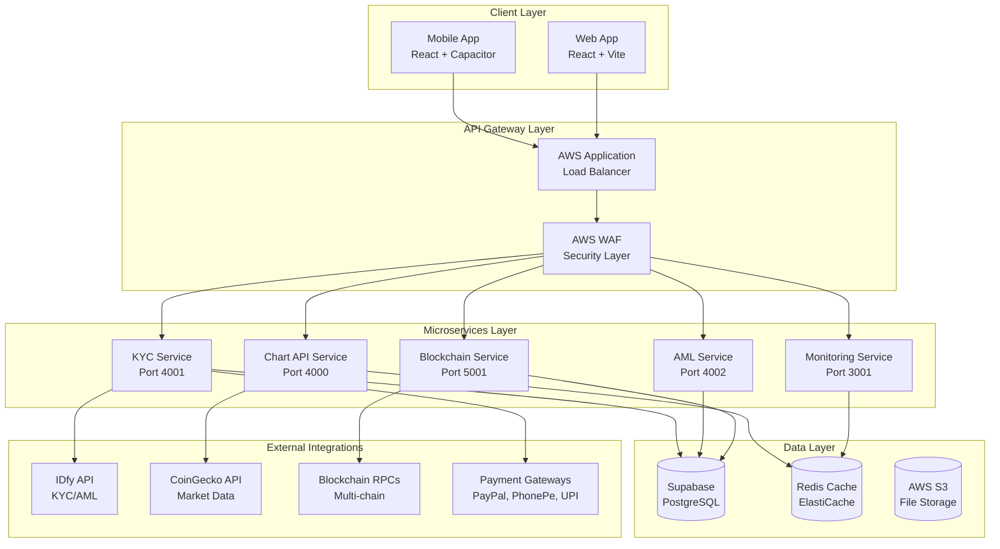

# 🏗️ DEX Mobile v6 - Overall Architecture Overview

## 📋 Executive Summary

**DEX Mobile v6** is a comprehensive decentralized exchange mobile application built with modern web technologies and deployed as a hybrid mobile app. The system implements a microservices architecture with enterprise-grade features including KYC/AML compliance, multi-chain blockchain support, and advanced trading capabilities.

**Key Metrics:**
- **Production Status**: ✅ Production Ready (69% health score)
- **Critical Services**: 11/11 operational
- **Supported Networks**: 6 blockchain networks (Ethereum, BSC, Polygon, Arbitrum + testnets)
- **Architecture Pattern**: Microservices with event-driven communication
- **Deployment**: AWS Cloud with multi-tier architecture

---

## 🎯 System Architecture Overview

### High-Level Architecture Diagram



---

## 🛠️ Technology Stack Analysis

### Frontend Technologies
| Component | Technology | Version | Purpose |
|-----------|------------|---------|---------|
| **Framework** | React | 18.3.1 | UI component library |
| **Build Tool** | Vite | 5.4.1 | Fast development and build |
| **Language** | TypeScript | 5.5.3 | Type-safe development |
| **Styling** | Tailwind CSS | 3.4.11 | Utility-first CSS framework |
| **UI Components** | Radix UI | Various | Accessible component primitives |
| **Mobile** | Capacitor | 7.2.0 | Native mobile app wrapper |
| **State Management** | React Context | Built-in | Application state management |
| **Routing** | React Router | 6.26.2 | Client-side routing |

### Backend Technologies
| Component | Technology | Version | Purpose |
|-----------|------------|---------|---------|
| **Runtime** | Node.js | Latest | JavaScript runtime |
| **Framework** | Express.js | Latest | Web application framework |
| **Database** | PostgreSQL | Latest | Primary data storage (Supabase) |
| **Cache** | Redis | Latest | In-memory caching |
| **Authentication** | Supabase Auth | 2.49.4 | User authentication & authorization |
| **File Storage** | AWS S3 | Latest | Document and media storage |

### Blockchain Technologies
| Component | Technology | Version | Purpose |
|-----------|------------|---------|---------|
| **Ethereum Client** | Ethers.js | 5.8.0 | Ethereum blockchain interaction |
| **Wallet Integration** | MetaMask SDK | 0.33.0 | Wallet connectivity |
| **DEX Protocol** | Uniswap V3 SDK | 3.25.2 | Decentralized exchange integration |
| **Multi-chain** | Various RPCs | Latest | Cross-chain support |
| **Solana Support** | Solana Web3.js | 1.98.2 | Solana blockchain integration |

### DevOps & Infrastructure
| Component | Technology | Purpose |
|-----------|------------|---------|
| **Cloud Provider** | AWS | Primary cloud infrastructure |
| **Container Orchestration** | ECS/EKS | Microservices deployment |
| **Load Balancer** | AWS ALB | Traffic distribution |
| **Monitoring** | CloudWatch + Prometheus | System monitoring |
| **CI/CD** | GitHub Actions | Automated deployment |
| **Infrastructure as Code** | Terraform | Infrastructure management |

---

## 🏛️ Architectural Patterns

### 1. Microservices Architecture
- **Service Decomposition**: Business capability-based service boundaries
- **Independent Deployment**: Each service can be deployed independently
- **Technology Diversity**: Services can use different technologies as needed
- **Fault Isolation**: Failure in one service doesn't affect others

### 2. Event-Driven Architecture
- **Asynchronous Communication**: Services communicate via events
- **Loose Coupling**: Services are decoupled through event streams
- **Scalability**: Easy to scale individual services based on load
- **Resilience**: System continues to function even if some services are down

### 3. Layered Architecture
- **Presentation Layer**: React frontend with mobile capabilities
- **API Gateway Layer**: Load balancing and security
- **Business Logic Layer**: Microservices handling specific domains
- **Data Access Layer**: Database and cache interactions
- **Integration Layer**: External API and blockchain integrations

### 4. Domain-Driven Design (DDD)
- **Bounded Contexts**: Clear service boundaries (KYC, Trading, Payments)
- **Ubiquitous Language**: Consistent terminology across domains
- **Aggregate Patterns**: Data consistency within service boundaries
- **Anti-Corruption Layer**: Clean integration with external systems

---

## 🔄 Data Flow Architecture

### User Authentication Flow
```
User → Frontend → Supabase Auth → JWT Token → Service Authorization
```

### Trading Flow
```
User → Swap Request → DEX Service → Blockchain Service → Smart Contract → Transaction
```

### KYC/AML Flow
```
User → KYC Form → KYC Service → IDfy API → AML Service → Compliance Check → Approval
```

### Market Data Flow
```
CoinGecko API → Chart Service → Redis Cache → Frontend → Real-time Updates
```

---

## 🔐 Security Architecture

### Authentication & Authorization
- **JWT Tokens**: Stateless authentication
- **Role-Based Access Control (RBAC)**: User permission management
- **Multi-Factor Authentication (MFA)**: Enhanced security
- **Session Management**: Secure session handling

### Data Protection
- **Encryption at Rest**: Database and file encryption
- **Encryption in Transit**: TLS 1.3 for all communications
- **Key Management**: AWS KMS for encryption keys
- **Secrets Management**: AWS Secrets Manager

### Network Security
- **WAF Protection**: Web Application Firewall
- **VPC Isolation**: Private network segments
- **Security Groups**: Granular access control
- **DDoS Protection**: AWS Shield integration

---

## 📊 Scalability Design

### Horizontal Scaling
- **Microservices**: Independent service scaling
- **Load Balancing**: Traffic distribution across instances
- **Auto Scaling**: Dynamic resource allocation
- **Database Sharding**: Data distribution strategies

### Vertical Scaling
- **Resource Optimization**: CPU and memory tuning
- **Performance Monitoring**: Real-time metrics
- **Caching Strategies**: Multi-layer caching
- **Database Optimization**: Query and index optimization

### Global Scaling
- **Multi-Region Deployment**: Geographic distribution
- **CDN Integration**: Content delivery optimization
- **Edge Computing**: Reduced latency
- **Data Replication**: Cross-region data sync

---

## 🎯 Enterprise Features

### Compliance & Governance
- **KYC/AML Integration**: Regulatory compliance
- **Audit Trails**: Complete transaction logging
- **Data Governance**: GDPR and privacy compliance
- **Regulatory Reporting**: Automated compliance reports

### Monitoring & Observability
- **Health Checks**: Service availability monitoring
- **Performance Metrics**: Real-time performance tracking
- **Distributed Tracing**: Request flow visualization
- **Alerting**: Proactive issue notification

### Business Continuity
- **High Availability**: 99.9% uptime target
- **Disaster Recovery**: Automated backup and recovery
- **Fault Tolerance**: Graceful degradation
- **Load Testing**: Performance validation

---

## 🚀 Deployment Architecture

### Container Strategy
- **Docker Containerization**: All services containerized
- **Multi-stage Builds**: Optimized container images
- **Security Scanning**: Automated vulnerability detection
- **Registry Management**: AWS ECR for image storage

### Orchestration
- **EKS for Complex Services**: Kubernetes for blockchain service
- **ECS for Standard Services**: Managed containers for most services
- **EC2 for Monitoring**: Direct control for monitoring stack
- **Auto Scaling**: Dynamic resource management

### Environment Management
- **Development**: Local development with Docker Compose
- **Staging**: AWS staging environment for testing
- **Production**: Multi-AZ production deployment
- **Disaster Recovery**: Cross-region backup environment

---

## 📈 Performance Optimization

### Frontend Optimization
- **Code Splitting**: Lazy loading of components
- **Bundle Optimization**: Tree shaking and minification
- **Caching Strategy**: Browser and CDN caching
- **Progressive Web App**: Offline capabilities

### Backend Optimization
- **Connection Pooling**: Database connection optimization
- **Query Optimization**: Efficient database queries
- **Caching Layers**: Redis for frequently accessed data
- **API Rate Limiting**: Protection against abuse

### Mobile Optimization
- **Native Performance**: Capacitor for native features
- **Battery Optimization**: Efficient background processing
- **Network Optimization**: Reduced data usage
- **Offline Support**: Local data storage and sync

---

*This architecture overview provides the foundation for understanding the DEX Mobile v6 system design and implementation approach. The system is designed for enterprise-scale deployment with comprehensive security, compliance, and scalability features.*