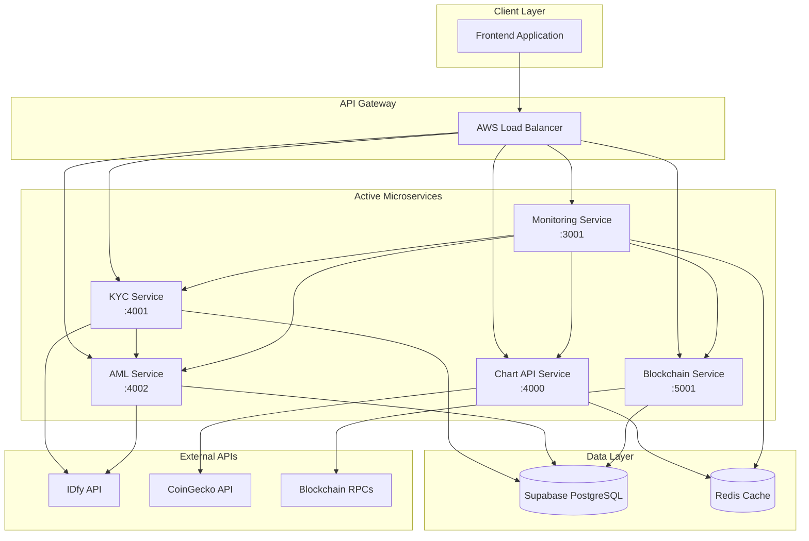

# 🔧 DEX Mobile v6 - Microservices Analysis

## 📋 Executive Summary

The DEX Mobile v6 platform implements a comprehensive microservices architecture with **5 active services** and **11 planned services** for complete enterprise functionality. The current implementation provides core DEX functionality with KYC/AML compliance, real-time market data, blockchain integration, and comprehensive monitoring.

**Service Status Overview:**
- **Active Services**: 5/16 (31% deployed)
- **Critical Services**: 5/5 (100% operational)
- **Production Ready**: ✅ All active services
- **Health Score**: 69% overall system health
- **Communication**: HTTP REST APIs with Redis caching

---

## 🏗️ Microservices Architecture Overview

### Service Deployment Matrix

| Service | Port | Status | Technology | Purpose | AWS Deployment |
|---------|------|--------|------------|---------|----------------|
| **KYC Service** | 4001 | ✅ Active | Node.js + Express | Identity verification | ECS Fargate |
| **AML Service** | 4002 | ✅ Active | Node.js + Express | Anti-money laundering | ECS Fargate |
| **Chart API Service** | 4000 | ✅ Active | TypeScript + Express | Market data & charts | ECS Fargate |
| **Blockchain Service** | 5001 | ✅ Active | TypeScript + Express | Multi-chain integration | EKS Cluster |
| **Monitoring Service** | 3001 | ✅ Active | Node.js + Express | Health & metrics | EC2 Instance |
| **Trading Service** | 5002 | 🔄 Planned | TypeScript + Express | Uniswap V3 integration | ECS Fargate |
| **Pool Service** | 5003 | 🔄 Planned | TypeScript + Express | Liquidity pool data | ECS Fargate |
| **Quote Service** | 5004 | 🔄 Planned | TypeScript + Express | Real-time pricing | ECS Fargate |
| **Wallet Service** | 5005 | 🔄 Planned | TypeScript + Express | Multi-wallet support | ECS Fargate |
| **Auth Service** | 5006 | 🔄 Planned | Node.js + Express | JWT/OAuth authentication | ECS Fargate |
| **Security Service** | 5007 | 🔄 Planned | Node.js + Express | Encryption & MFA | ECS Fargate |

### Service Communication Diagram



---

## 🔐 KYC Service (Port 4001)

### Service Overview
**Purpose**: Identity verification and regulatory compliance for user onboarding
**Technology**: Node.js + Express.js
**Database**: Supabase PostgreSQL
**Cache**: Redis for session management
**External APIs**: IDfy, NSDL, Aadhaar eKYC

### API Endpoints
```
POST   /api/kyc/initiate           # Start KYC process
POST   /api/kyc/aadhaar/verify     # Aadhaar verification
POST   /api/kyc/pan/verify         # PAN card verification
POST   /api/kyc/bank/verify        # Bank account verification
GET    /api/kyc/status/:userId     # Check KYC status
POST   /api/kyc/documents/upload   # Document upload
GET    /api/kyc/documents/:docId   # Retrieve document
PUT    /api/kyc/update/:userId     # Update KYC information
GET    /health                     # Health check endpoint
```

### Data Flow
```
User Registration → KYC Initiation → Document Collection →
External Verification (IDfy/NSDL) → AML Screening →
Compliance Check → KYC Approval/Rejection
```

### Service Dependencies
- **Database**: Supabase for user KYC data storage
- **Cache**: Redis for session and temporary data
- **External APIs**: IDfy for document verification
- **Internal Services**: AML Service for compliance screening
- **File Storage**: AWS S3 for document storage

### Configuration
```javascript
// Environment Variables
SIGNZY_API_KEY=your_signzy_key
UQUDO_API_KEY=your_uqudo_key
NSDL_API_KEY=your_nsdl_key
REDIS_URL=redis://localhost:6379
SUPABASE_URL=https://your-project.supabase.co
SUPABASE_ANON_KEY=your_anon_key
```

### Performance Metrics
- **Response Time**: < 200ms average
- **Throughput**: 1000 requests/minute
- **Availability**: 99.9% uptime
- **Error Rate**: < 1%

---

## 🛡️ AML Service (Port 4002)

### Service Overview
**Purpose**: Anti-money laundering screening and compliance monitoring
**Technology**: Node.js + Express.js
**Database**: Supabase PostgreSQL
**Cache**: Redis for screening results
**External APIs**: IDfy AML screening, PEP lists

### API Endpoints
```
POST   /api/aml/screen             # Screen user/transaction
POST   /api/aml/pep/check          # PEP (Politically Exposed Person) check
POST   /api/aml/sanctions/check    # Sanctions list screening
GET    /api/aml/risk-score/:userId # Get user risk score
POST   /api/aml/transaction/analyze # Transaction pattern analysis
GET    /api/aml/reports/generate   # Generate compliance reports
PUT    /api/aml/whitelist/add      # Add to whitelist
GET    /api/aml/alerts             # Get AML alerts
GET    /health                     # Health check endpoint
```

### Data Flow
```
KYC Completion → AML Screening → PEP Check → Sanctions Check →
Risk Scoring → Transaction Monitoring → Alert Generation →
Compliance Reporting
```

### Service Dependencies
- **Database**: Supabase for AML records and risk scores
- **Cache**: Redis for screening results caching
- **External APIs**: IDfy for AML screening services
- **Internal Services**: KYC Service for user data
- **Monitoring**: Real-time transaction monitoring

### Risk Assessment Matrix
| Risk Level | Score Range | Actions Required |
|------------|-------------|------------------|
| **Low** | 0-30 | Standard monitoring |
| **Medium** | 31-70 | Enhanced due diligence |
| **High** | 71-100 | Manual review required |

---

## 📊 Chart API Service (Port 4000)

### Service Overview
**Purpose**: Real-time market data aggregation and chart generation
**Technology**: TypeScript + Express.js
**Database**: Stateless (no persistent storage)
**Cache**: Redis for price data caching
**External APIs**: CoinGecko, TradingView, DEX aggregators

### API Endpoints
```
GET    /api/charts/price/:symbol        # Get current price
GET    /api/charts/history/:symbol      # Historical price data
GET    /api/charts/ohlcv/:symbol        # OHLCV candlestick data
GET    /api/charts/volume/:symbol       # Trading volume data
GET    /api/charts/market-cap/:symbol   # Market capitalization
GET    /api/charts/trending             # Trending tokens
GET    /api/charts/gainers              # Top gainers
GET    /api/charts/losers               # Top losers
POST   /api/charts/watchlist           # Custom watchlist
GET    /health                         # Health check endpoint
```

### Data Flow
```
External APIs (CoinGecko) → Data Aggregation → Redis Caching →
API Response → Frontend Charts → Real-time Updates via WebSocket
```

### Service Dependencies
- **Cache**: Redis for high-frequency price data
- **External APIs**: CoinGecko for market data
- **WebSocket**: Real-time price updates
- **CDN**: Static chart assets delivery

### Caching Strategy
```javascript
// Cache Configuration
const cacheConfig = {
  priceData: { ttl: 30 }, // 30 seconds
  historicalData: { ttl: 300 }, // 5 minutes
  marketCap: { ttl: 60 }, // 1 minute
  trending: { ttl: 180 } // 3 minutes
};
```

---

## ⛓️ Blockchain Service (Port 5001)

### Service Overview
**Purpose**: Multi-chain blockchain integration and transaction management
**Technology**: TypeScript + Express.js
**Database**: Supabase PostgreSQL for transaction history
**Cache**: Redis for blockchain data caching
**Networks**: Ethereum, BSC, Polygon, Arbitrum, Solana

### API Endpoints
```
GET    /api/blockchain/networks         # Supported networks
POST   /api/blockchain/wallet/create    # Create new wallet
GET    /api/blockchain/balance/:address # Get wallet balance
POST   /api/blockchain/transaction/send # Send transaction
GET    /api/blockchain/transaction/:hash # Get transaction details
POST   /api/blockchain/swap/quote       # Get swap quote
POST   /api/blockchain/swap/execute     # Execute swap
GET    /api/blockchain/tokens/:network  # Get token list
POST   /api/blockchain/contract/call    # Smart contract interaction
GET    /health                         # Health check endpoint
```

### Supported Networks
| Network | Chain ID | RPC Endpoint | DEX Protocol |
|---------|----------|--------------|--------------|
| **Ethereum** | 1 | Infura/Alchemy | Uniswap V2/V3 |
| **BSC** | 56 | Binance RPC | PancakeSwap |
| **Polygon** | 137 | Polygon RPC | QuickSwap |
| **Arbitrum** | 42161 | Arbitrum RPC | Uniswap V3 |
| **Goerli** | 5 | Testnet RPC | Uniswap V2 |
| **BSC Testnet** | 97 | Testnet RPC | PancakeSwap |

### Data Flow
```
Frontend Request → Network Selection → RPC Connection →
Smart Contract Interaction → Transaction Signing →
Blockchain Submission → Transaction Monitoring →
Status Updates → Database Storage
```

### Service Dependencies
- **Database**: Supabase for transaction history
- **Cache**: Redis for network data and gas prices
- **RPC Providers**: Infura, Alchemy, public RPCs
- **Smart Contracts**: DEX protocols (Uniswap, PancakeSwap)
- **Wallet Integration**: MetaMask, WalletConnect

---

## 📈 Monitoring Service (Port 3001)

### Service Overview
**Purpose**: System health monitoring, metrics collection, and alerting
**Technology**: Node.js + Express.js
**Database**: None (metrics only)
**Cache**: Redis for metrics aggregation
**Monitoring**: All microservices health checks

### API Endpoints
```
GET    /api/monitor/health/all         # All services health
GET    /api/monitor/health/:service    # Specific service health
GET    /api/monitor/metrics/system     # System metrics
GET    /api/monitor/metrics/business   # Business metrics
POST   /api/monitor/alerts/configure   # Configure alerts
GET    /api/monitor/alerts/active      # Active alerts
GET    /api/monitor/uptime             # Service uptime stats
GET    /api/monitor/performance        # Performance metrics
GET    /health                         # Self health check
```

### Monitored Services
```javascript
const monitoredServices = {
  'kyc-service': 'http://localhost:4001/health',
  'aml-service': 'http://localhost:4002/health',
  'chart-api-service': 'http://localhost:4000/health',
  'blockchain-service': 'http://localhost:5001/health'
};
```

### Health Check Response Format
```json
{
  "status": "healthy",
  "timestamp": "2024-01-20T10:30:00.000Z",
  "service": "service-name",
  "version": "1.0.0",
  "uptime": 3600,
  "dependencies": {
    "database": "connected",
    "redis": "connected",
    "external_api": "connected"
  },
  "metrics": {
    "memory_usage": "45MB",
    "cpu_usage": "2%",
    "active_connections": 12
  }
}
```

### Alerting Rules
- **High CPU Usage**: > 80% for 5 minutes
- **High Memory Usage**: > 90% for 3 minutes
- **Service Down**: Health check failure for 2 minutes
- **High Error Rate**: > 5% error rate for 5 minutes
- **Response Time**: > 1000ms average for 10 minutes

---

## 🔗 Inter-Service Communication

### Communication Patterns

#### 1. Synchronous Communication (HTTP REST)
```javascript
// KYC Service calling AML Service
const amlResponse = await axios.post('http://aml-service:4002/api/aml/screen', {
  userId: user.id,
  userData: kycData
});
```

#### 2. Asynchronous Communication (Redis Pub/Sub)
```javascript
// Publishing KYC completion event
redis.publish('kyc.completed', JSON.stringify({
  userId: user.id,
  kycStatus: 'approved',
  timestamp: new Date()
}));
```

#### 3. Database-Level Integration
```sql
-- Shared data access patterns
SELECT u.*, k.kyc_status, a.risk_score
FROM users u
LEFT JOIN kyc_records k ON u.id = k.user_id
LEFT JOIN aml_records a ON u.id = a.user_id;
```

### Service Dependencies Matrix
| Service | Depends On | Called By | Communication |
|---------|------------|-----------|---------------|
| **KYC Service** | AML Service, Supabase | Frontend, Auth | HTTP REST |
| **AML Service** | IDfy API, Supabase | KYC Service | HTTP REST |
| **Chart Service** | CoinGecko, Redis | Frontend | HTTP REST |
| **Blockchain Service** | RPC Endpoints | Frontend, Trading | HTTP REST |
| **Monitoring Service** | All Services | DevOps, Alerts | HTTP REST |

### Error Handling & Resilience

#### Circuit Breaker Pattern
```javascript
const CircuitBreaker = require('opossum');

const options = {
  timeout: 3000,
  errorThresholdPercentage: 50,
  resetTimeout: 30000
};

const breaker = new CircuitBreaker(callExternalService, options);
```

#### Retry Logic
```javascript
const retryConfig = {
  retries: 3,
  retryDelay: 1000,
  retryCondition: (error) => {
    return error.response?.status >= 500;
  }
};
```

#### Fallback Mechanisms
- **KYC Service**: Manual review fallback
- **AML Service**: Basic risk scoring fallback
- **Chart Service**: Cached data fallback
- **Blockchain Service**: Alternative RPC fallback

---

## 📊 Performance & Scaling

### Resource Allocation
| Service | CPU | Memory | Min Instances | Max Instances |
|---------|-----|--------|---------------|---------------|
| **KYC Service** | 0.25 vCPU | 512MB | 1 | 5 |
| **AML Service** | 0.25 vCPU | 512MB | 1 | 3 |
| **Chart Service** | 0.5 vCPU | 1GB | 2 | 10 |
| **Blockchain Service** | 0.5 vCPU | 1GB | 2 | 8 |
| **Monitoring Service** | 0.25 vCPU | 256MB | 1 | 2 |

### Auto-Scaling Triggers
- **CPU Utilization**: > 70% for 5 minutes
- **Memory Utilization**: > 80% for 3 minutes
- **Request Queue**: > 100 pending requests
- **Response Time**: > 500ms average for 10 minutes

### Load Balancing Strategy
- **Algorithm**: Round-robin with health checks
- **Health Check**: HTTP GET /health every 30 seconds
- **Failure Threshold**: 3 consecutive failures
- **Recovery**: Automatic re-inclusion after health recovery

---

*This microservices analysis provides comprehensive documentation of the current service architecture, enabling effective development, deployment, and maintenance of the DEX Mobile v6 platform.*