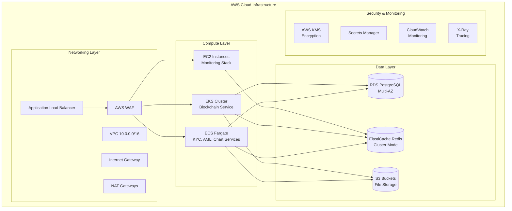

# ☁️ DEX Mobile v6 - AWS Integration Documentation

## 📋 Executive Summary

The DEX Mobile v6 platform leverages a comprehensive AWS cloud infrastructure designed for enterprise-scale deployment with high availability, security, and compliance. The architecture implements a multi-tier approach using EKS, ECS, and EC2 services optimized for different workload characteristics.

**AWS Infrastructure Overview:**
- **Total Services**: 15+ AWS services integrated
- **Deployment Strategy**: Multi-service approach (EKS + ECS + EC2)
- **Estimated Monthly Cost**: $425-1,405 (based on usage)
- **Availability Target**: 99.9% uptime
- **Security**: Enterprise-grade with WAF, VPC, and encryption

---

## 🏗️ AWS Services Architecture

### Service Deployment Strategy



### AWS Service Utilization Matrix

| AWS Service | Purpose | Configuration | Cost Impact |
|-------------|---------|---------------|-------------|
| **EKS (Elastic Kubernetes Service)** | Blockchain service orchestration | t3.medium nodes, 2-10 instances | High |
| **ECS Fargate** | Containerized microservices | 1 vCPU, 2GB RAM per task | Medium |
| **EC2** | Monitoring and legacy services | t3.small instances | Low |
| **RDS PostgreSQL** | Primary database (Multi-AZ) | db.t3.medium | Medium |
| **ElastiCache Redis** | Caching and session storage | cache.t3.micro cluster | Low |
| **S3** | File storage and static assets | Standard storage class | Low |
| **Application Load Balancer** | Traffic distribution | Standard ALB | Low |
| **WAF** | Web application firewall | Managed rules | Low |
| **CloudWatch** | Monitoring and logging | Standard metrics | Low |
| **Secrets Manager** | Secure credential storage | Per secret pricing | Low |
| **KMS** | Encryption key management | Per key pricing | Low |
| **X-Ray** | Distributed tracing | Per trace pricing | Low |

---

## 🏛️ Infrastructure as Code (Terraform)

### Terraform Configuration Structure
```
infrastructure/terraform/
├── main.tf                    # Main configuration
├── api-gateway.tf            # API Gateway setup
├── ecs.tf                    # ECS cluster configuration
├── monitoring.tf             # CloudWatch and monitoring
└── outputs.tf                # Infrastructure outputs
```

### Main Infrastructure Configuration
```hcl
# main.tf - Core Infrastructure
provider "aws" {
  region = var.aws_region
}

# VPC Configuration
resource "aws_vpc" "dex_vpc" {
  cidr_block           = "10.0.0.0/16"
  enable_dns_hostnames = true
  enable_dns_support   = true

  tags = {
    Name = "dex-mobile-vpc"
    Environment = var.environment
  }
}

# Public Subnets
resource "aws_subnet" "public_subnets" {
  count             = 2
  vpc_id            = aws_vpc.dex_vpc.id
  cidr_block        = "10.0.${count.index + 1}.0/24"
  availability_zone = data.aws_availability_zones.available.names[count.index]

  map_public_ip_on_launch = true

  tags = {
    Name = "dex-public-subnet-${count.index + 1}"
    Type = "Public"
  }
}

# Private Subnets
resource "aws_subnet" "private_subnets" {
  count             = 2
  vpc_id            = aws_vpc.dex_vpc.id
  cidr_block        = "10.0.${count.index + 10}.0/24"
  availability_zone = data.aws_availability_zones.available.names[count.index]

  tags = {
    Name = "dex-private-subnet-${count.index + 1}"
    Type = "Private"
  }
}
```

### ECS Configuration
```hcl
# ecs.tf - ECS Cluster Setup
resource "aws_ecs_cluster" "dex_cluster" {
  name = "dex-mobile-cluster"

  capacity_providers = ["FARGATE", "FARGATE_SPOT"]

  default_capacity_provider_strategy {
    capacity_provider = "FARGATE"
    weight           = 1
  }

  setting {
    name  = "containerInsights"
    value = "enabled"
  }
}

# KYC Service Task Definition
resource "aws_ecs_task_definition" "kyc_service" {
  family                   = "kyc-service"
  network_mode             = "awsvpc"
  requires_compatibilities = ["FARGATE"]
  cpu                      = 256
  memory                   = 512
  execution_role_arn       = aws_iam_role.ecs_execution_role.arn
  task_role_arn           = aws_iam_role.ecs_task_role.arn

  container_definitions = jsonencode([
    {
      name  = "kyc-service"
      image = "${aws_ecr_repository.kyc_service.repository_url}:latest"

      portMappings = [
        {
          containerPort = 4001
          protocol      = "tcp"
        }
      ]

      environment = [
        {
          name  = "NODE_ENV"
          value = var.environment
        },
        {
          name  = "PORT"
          value = "4001"
        }
      ]

      secrets = [
        {
          name      = "SUPABASE_URL"
          valueFrom = aws_secretsmanager_secret.supabase_url.arn
        },
        {
          name      = "SIGNZY_API_KEY"
          valueFrom = aws_secretsmanager_secret.signzy_api_key.arn
        }
      ]

      logConfiguration = {
        logDriver = "awslogs"
        options = {
          awslogs-group         = aws_cloudwatch_log_group.kyc_service.name
          awslogs-region        = var.aws_region
          awslogs-stream-prefix = "ecs"
        }
      }

      healthCheck = {
        command     = ["CMD-SHELL", "curl -f http://localhost:4001/health || exit 1"]
        interval    = 30
        timeout     = 5
        retries     = 3
        startPeriod = 60
      }
    }
  ])
}
```

---

## 🐳 Container Registry & Images

### Amazon ECR (Elastic Container Registry)
```bash
# ECR Repository Creation
aws ecr create-repository --repository-name dex-mobile/kyc-service
aws ecr create-repository --repository-name dex-mobile/aml-service
aws ecr create-repository --repository-name dex-mobile/chart-api-service
aws ecr create-repository --repository-name dex-mobile/blockchain-service
aws ecr create-repository --repository-name dex-mobile/monitoring-service
```

### Docker Image Build & Push Pipeline
```yaml
# .github/workflows/deploy.yml
name: Deploy to AWS
on:
  push:
    branches: [main]

jobs:
  deploy:
    runs-on: ubuntu-latest
    steps:
      - uses: actions/checkout@v3

      - name: Configure AWS credentials
        uses: aws-actions/configure-aws-credentials@v2
        with:
          aws-access-key-id: ${{ secrets.AWS_ACCESS_KEY_ID }}
          aws-secret-access-key: ${{ secrets.AWS_SECRET_ACCESS_KEY }}
          aws-region: us-east-1

      - name: Login to Amazon ECR
        id: login-ecr
        uses: aws-actions/amazon-ecr-login@v1

      - name: Build and push KYC service
        env:
          ECR_REGISTRY: ${{ steps.login-ecr.outputs.registry }}
          ECR_REPOSITORY: dex-mobile/kyc-service
          IMAGE_TAG: ${{ github.sha }}
        run: |
          docker build -t $ECR_REGISTRY/$ECR_REPOSITORY:$IMAGE_TAG ./microservices/kyc-service
          docker push $ECR_REGISTRY/$ECR_REPOSITORY:$IMAGE_TAG

      - name: Deploy to ECS
        run: |
          aws ecs update-service --cluster dex-mobile-cluster --service kyc-service --force-new-deployment

---

## 🔐 Security & Compliance

### AWS WAF Configuration
```yaml
# WAF Rules for API Protection
Resources:
  DexMobileWebACL:
    Type: AWS::WAFv2::WebACL
    Properties:
      Name: dex-mobile-waf
      Scope: REGIONAL
      DefaultAction:
        Allow: {}
      Rules:
        - Name: AWSManagedRulesCommonRuleSet
          Priority: 1
          OverrideAction:
            None: {}
          Statement:
            ManagedRuleGroupStatement:
              VendorName: AWS
              Name: AWSManagedRulesCommonRuleSet
          VisibilityConfig:
            SampledRequestsEnabled: true
            CloudWatchMetricsEnabled: true
            MetricName: CommonRuleSetMetric

        - Name: RateLimitRule
          Priority: 2
          Action:
            Block: {}
          Statement:
            RateBasedStatement:
              Limit: 2000
              AggregateKeyType: IP
          VisibilityConfig:
            SampledRequestsEnabled: true
            CloudWatchMetricsEnabled: true
            MetricName: RateLimitMetric
```

### Secrets Management
```bash
# AWS Secrets Manager Configuration
aws secretsmanager create-secret \
  --name "dex-mobile/supabase-url" \
  --description "Supabase database URL" \
  --secret-string "https://your-project.supabase.co"

aws secretsmanager create-secret \
  --name "dex-mobile/supabase-anon-key" \
  --description "Supabase anonymous key" \
  --secret-string "your-anon-key"

aws secretsmanager create-secret \
  --name "dex-mobile/signzy-api-key" \
  --description "Signzy KYC API key" \
  --secret-string "your-signzy-key"

aws secretsmanager create-secret \
  --name "dex-mobile/coingecko-api-key" \
  --description "CoinGecko API key" \
  --secret-string "your-coingecko-key"
```

### IAM Roles & Policies
```json
{
  "Version": "2012-10-17",
  "Statement": [
    {
      "Effect": "Allow",
      "Action": [
        "secretsmanager:GetSecretValue"
      ],
      "Resource": [
        "arn:aws:secretsmanager:*:*:secret:dex-mobile/*"
      ]
    },
    {
      "Effect": "Allow",
      "Action": [
        "s3:GetObject",
        "s3:PutObject",
        "s3:DeleteObject"
      ],
      "Resource": [
        "arn:aws:s3:::dex-mobile-documents/*"
      ]
    },
    {
      "Effect": "Allow",
      "Action": [
        "logs:CreateLogGroup",
        "logs:CreateLogStream",
        "logs:PutLogEvents"
      ],
      "Resource": "*"
    }
  ]
}
```

---

## 📊 Monitoring & Observability

### CloudWatch Configuration
```yaml
# CloudWatch Log Groups
Resources:
  KYCServiceLogGroup:
    Type: AWS::Logs::LogGroup
    Properties:
      LogGroupName: /ecs/kyc-service
      RetentionInDays: 30

  AMLServiceLogGroup:
    Type: AWS::Logs::LogGroup
    Properties:
      LogGroupName: /ecs/aml-service
      RetentionInDays: 30

  ChartServiceLogGroup:
    Type: AWS::Logs::LogGroup
    Properties:
      LogGroupName: /ecs/chart-api-service
      RetentionInDays: 30
```

### CloudWatch Alarms
```yaml
# High CPU Utilization Alarm
HighCPUAlarm:
  Type: AWS::CloudWatch::Alarm
  Properties:
    AlarmName: dex-mobile-high-cpu
    AlarmDescription: High CPU utilization detected
    MetricName: CPUUtilization
    Namespace: AWS/ECS
    Statistic: Average
    Period: 300
    EvaluationPeriods: 2
    Threshold: 80
    ComparisonOperator: GreaterThanThreshold
    Dimensions:
      - Name: ServiceName
        Value: kyc-service
      - Name: ClusterName
        Value: dex-mobile-cluster
    AlarmActions:
      - !Ref SNSTopicArn

# High Memory Utilization Alarm
HighMemoryAlarm:
  Type: AWS::CloudWatch::Alarm
  Properties:
    AlarmName: dex-mobile-high-memory
    AlarmDescription: High memory utilization detected
    MetricName: MemoryUtilization
    Namespace: AWS/ECS
    Statistic: Average
    Period: 300
    EvaluationPeriods: 2
    Threshold: 90
    ComparisonOperator: GreaterThanThreshold
```

### X-Ray Distributed Tracing
```javascript
// X-Ray SDK Integration
const AWSXRay = require('aws-xray-sdk-core');
const AWS = AWSXRay.captureAWS(require('aws-sdk'));

// Express middleware
app.use(AWSXRay.express.openSegment('dex-mobile-kyc'));

// Custom subsegment
app.get('/api/kyc/verify', (req, res) => {
  const subsegment = AWSXRay.getSegment().addNewSubsegment('kyc-verification');

  try {
    // KYC verification logic
    const result = performKYCVerification(req.body);
    subsegment.addAnnotation('verification_status', result.status);
    res.json(result);
  } catch (error) {
    subsegment.addError(error);
    throw error;
  } finally {
    subsegment.close();
  }
});

app.use(AWSXRay.express.closeSegment());
```

---

## 💰 Cost Optimization

### Resource Sizing & Cost Analysis
| Service | Instance Type | Monthly Hours | Cost per Hour | Monthly Cost |
|---------|---------------|---------------|---------------|--------------|
| **EKS Control Plane** | Managed | 744 | $0.10 | $74.40 |
| **EKS Worker Nodes** | t3.medium (2-10) | 1488-7440 | $0.0416 | $61.90-309.50 |
| **ECS Fargate Tasks** | 1 vCPU, 2GB (2-8) | 1488-5952 | $0.04048 | $60.23-240.92 |
| **EC2 Monitoring** | t3.small (1-2) | 744-1488 | $0.0208 | $15.48-30.96 |
| **RDS PostgreSQL** | db.t3.medium | 744 | $0.068 | $50.59 |
| **ElastiCache Redis** | cache.t3.micro (1-3) | 744-2232 | $0.017 | $12.65-37.94 |
| **Application Load Balancer** | Standard | 744 | $0.0225 | $16.74 |
| **Data Transfer** | Various | - | Variable | $20-50 |

**Total Estimated Monthly Cost: $312-860**

### Cost Optimization Strategies
```yaml
# Auto Scaling Configuration
AutoScalingTarget:
  Type: AWS::ApplicationAutoScaling::ScalableTarget
  Properties:
    ServiceNamespace: ecs
    ResourceId: service/dex-mobile-cluster/kyc-service
    ScalableDimension: ecs:service:DesiredCount
    MinCapacity: 1
    MaxCapacity: 5
    RoleARN: !GetAtt ApplicationAutoScalingECSRole.Arn

# CPU-based scaling policy
CPUScalingPolicy:
  Type: AWS::ApplicationAutoScaling::ScalingPolicy
  Properties:
    PolicyName: cpu-scaling-policy
    PolicyType: TargetTrackingScaling
    ScalingTargetId: !Ref AutoScalingTarget
    TargetTrackingScalingPolicyConfiguration:
      TargetValue: 70.0
      PredefinedMetricSpecification:
        PredefinedMetricType: ECSServiceAverageCPUUtilization
      ScaleOutCooldown: 300
      ScaleInCooldown: 300
```

### Reserved Instances & Savings Plans
```bash
# RDS Reserved Instance
aws rds purchase-reserved-db-instances-offering \
  --reserved-db-instances-offering-id "your-offering-id" \
  --reserved-db-instance-id "dex-mobile-db-reserved"

# EC2 Savings Plan
aws savingsplans purchase-savings-plan \
  --savings-plan-type "EC2Instance" \
  --term-duration-in-years 1 \
  --payment-option "All Upfront" \
  --commitment "10.00"
```

---

## 🚀 Deployment Pipeline

### CI/CD Pipeline Architecture

```mermaid
graph LR
    A[GitHub Repository] --> B[GitHub Actions]
    B --> C[Build & Test]
    C --> D[Security Scan]
    D --> E[Build Docker Images]
    E --> F[Push to ECR]
    F --> G[Deploy to Staging]
    G --> H[Integration Tests]
    H --> I[Deploy to Production]
    I --> J[Health Checks]
    J --> K[Rollback if Failed]
```


### Environment Configuration
```yaml
# environments/staging.yml
environment: staging
aws_region: us-east-1
cluster_name: dex-mobile-staging
min_capacity: 1
max_capacity: 3
instance_type: t3.small
database_instance: db.t3.micro

# environments/production.yml
environment: production
aws_region: us-east-1
cluster_name: dex-mobile-production
min_capacity: 2
max_capacity: 10
instance_type: t3.medium
database_instance: db.t3.medium
```

### Blue-Green Deployment
```bash
#!/bin/bash
# Blue-Green Deployment Script

# Create new task definition with updated image
aws ecs register-task-definition \
  --family kyc-service \
  --task-definition file://task-definition.json

# Update service with new task definition
aws ecs update-service \
  --cluster dex-mobile-cluster \
  --service kyc-service \
  --task-definition kyc-service:LATEST

# Wait for deployment to complete
aws ecs wait services-stable \
  --cluster dex-mobile-cluster \
  --services kyc-service

# Health check
HEALTH_CHECK=$(curl -s -o /dev/null -w "%{http_code}" http://kyc-service.dex-mobile.com/health)

if [ $HEALTH_CHECK -eq 200 ]; then
  echo "Deployment successful"
  # Update load balancer to point to new version
else
  echo "Deployment failed, rolling back"
  # Rollback to previous task definition
  aws ecs update-service \
    --cluster dex-mobile-cluster \
    --service kyc-service \
    --task-definition kyc-service:PREVIOUS
fi
```

---

*This AWS integration documentation provides comprehensive guidance for deploying and managing the DEX Mobile v6 platform on AWS cloud infrastructure with enterprise-grade security, monitoring, and cost optimization.*
```