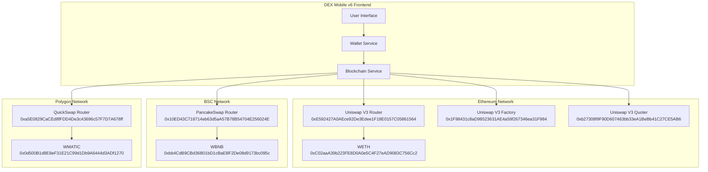
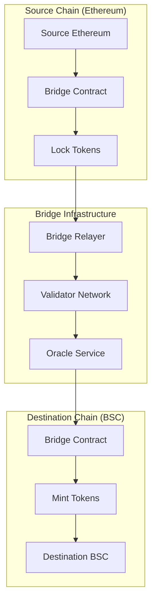

# ⛓️ DEX Mobile v6 - Blockchain Implementation Analysis

## 📋 Executive Summary

The DEX Mobile v6 platform implements a comprehensive multi-chain blockchain architecture supporting **6 major networks** with advanced DeFi integrations. The system leverages Uniswap V3 as the primary DEX protocol while maintaining compatibility with other major DEX platforms across different chains.

**Blockchain Integration Overview:**
- **Supported Networks**: 6 mainnets + 3 testnets
- **Primary DEX Protocol**: Uniswap V3 with V2 fallback
- **Smart Contract Standards**: ERC-20, BEP-20, Polygon tokens
- **Wallet Integration**: MetaMask, WalletConnect, Hardware wallets
- **Cross-chain Support**: Multi-chain asset management

---

## 🌐 Supported Blockchain Networks

### Mainnet Networks

| Network | Chain ID | Native Token | DEX Protocol | RPC Endpoint | Block Explorer |
|---------|----------|--------------|--------------|--------------|----------------|
| **Ethereum** | 1 | ETH | Uniswap V2/V3 | Infura/Alchemy | etherscan.io |
| **Binance Smart Chain** | 56 | BNB | PancakeSwap | Binance RPC | bscscan.com |
| **Polygon** | 137 | MATIC | QuickSwap | Polygon RPC | polygonscan.com |
| **Arbitrum** | 42161 | ETH | Uniswap V3 | Arbitrum RPC | arbiscan.io |

### Testnet Networks

| Network | Chain ID | Purpose | DEX Protocol | Status |
|---------|----------|---------|--------------|--------|
| **Goerli** | 5 | Ethereum testing | Uniswap V2 | ✅ Active |
| **BSC Testnet** | 97 | BSC testing | PancakeSwap | ✅ Active |
| **Mumbai** | 80001 | Polygon testing | QuickSwap | ✅ Active |

### Network Configuration Architecture
```typescript
// src/contracts/addresses.ts
export interface NetworkConfig {
  chainId: number;
  name: string;
  rpcUrl: string;
  blockExplorer: string;
  nativeCurrency: {
    name: string;
    symbol: string;
    decimals: number;
  };
  contracts: {
    uniswapV2Router?: string;
    uniswapV3Router?: string;
    uniswapV3Factory?: string;
    uniswapV3Quoter?: string;
    uniswapV3QuoterV2?: string;
    pancakeSwapRouter?: string;
    weth: string;
    usdt?: string;
    usdc?: string;
    dai?: string;
  };
}
```

---

## 🔗 Smart Contract Architecture

### Contract Integration Overview


### Smart Contract ABIs
```typescript
// src/contracts/abis/UniswapV3Router.ts
export const UNISWAP_V3_ROUTER_ABI = [
  {
    "inputs": [
      {
        "components": [
          {"internalType": "address", "name": "tokenIn", "type": "address"},
          {"internalType": "address", "name": "tokenOut", "type": "address"},
          {"internalType": "uint24", "name": "fee", "type": "uint24"},
          {"internalType": "address", "name": "recipient", "type": "address"},
          {"internalType": "uint256", "name": "deadline", "type": "uint256"},
          {"internalType": "uint256", "name": "amountIn", "type": "uint256"},
          {"internalType": "uint256", "name": "amountOutMinimum", "type": "uint256"},
          {"internalType": "uint160", "name": "sqrtPriceLimitX96", "type": "uint160"}
        ],
        "internalType": "struct ISwapRouter.ExactInputSingleParams",
        "name": "params",
        "type": "tuple"
      }
    ],
    "name": "exactInputSingle",
    "outputs": [{"internalType": "uint256", "name": "amountOut", "type": "uint256"}],
    "stateMutability": "payable",
    "type": "function"
  }
  // ... additional ABI methods
];
```

### Contract Address Management
```typescript
// Helper functions for contract addresses
export const getNetworkConfig = (networkId: string): NetworkConfig | null => {
  return NETWORK_CONFIGS[networkId] || null;
};

export const getUniswapV3RouterAddress = (networkId: string): string | null => {
  const config = getNetworkConfig(networkId);
  return config?.contracts.uniswapV3Router || null;
};

export const isUniswapV3Supported = (networkId: string): boolean => {
  const config = getNetworkConfig(networkId);
  return !!(config?.contracts.uniswapV3Router && config?.contracts.uniswapV3Factory);
};
```

---

## 💱 DEX Protocol Integration

### Uniswap V3 Integration
**Primary DEX Protocol** - Advanced automated market maker with concentrated liquidity

#### Key Features Implemented:
- **Concentrated Liquidity**: Capital efficiency optimization
- **Multiple Fee Tiers**: 0.05%, 0.30%, 1.00% fee options
- **Price Oracle**: Time-weighted average price (TWAP)
- **Flash Swaps**: Advanced trading mechanisms
- **Multi-hop Routing**: Optimal path finding

#### Swap Implementation
```typescript
// src/services/uniswapV3Service.ts
export class UniswapV3Service {
  private router: Contract;
  private quoter: Contract;

  async getSwapQuote(
    tokenIn: string,
    tokenOut: string,
    amountIn: BigNumber,
    fee: number = 3000
  ): Promise<SwapQuote> {
    const quoterContract = new Contract(
      this.quoterAddress,
      UNISWAP_V3_QUOTER_ABI,
      this.provider
    );

    const quote = await quoterContract.callStatic.quoteExactInputSingle(
      tokenIn,
      tokenOut,
      fee,
      amountIn,
      0
    );

    return {
      amountOut: quote,
      priceImpact: this.calculatePriceImpact(amountIn, quote),
      fee: fee,
      route: [tokenIn, tokenOut]
    };
  }

  async executeSwap(
    tokenIn: string,
    tokenOut: string,
    amountIn: BigNumber,
    amountOutMinimum: BigNumber,
    recipient: string,
    deadline: number,
    fee: number = 3000
  ): Promise<TransactionResponse> {
    const params = {
      tokenIn,
      tokenOut,
      fee,
      recipient,
      deadline,
      amountIn,
      amountOutMinimum,
      sqrtPriceLimitX96: 0
    };

    return await this.router.exactInputSingle(params, {
      value: tokenIn === WETH_ADDRESS ? amountIn : 0
    });
  }
}
```

### PancakeSwap Integration (BSC)
**Secondary DEX Protocol** - Binance Smart Chain's leading DEX

#### Implementation Features:
- **V2 AMM Model**: Traditional constant product formula
- **CAKE Token Integration**: Native token support
- **Syrup Pools**: Staking mechanisms
- **Lottery & Prediction**: Gamification features

```typescript
// PancakeSwap Router Integration
export class PancakeSwapService {
  async swapExactTokensForTokens(
    amountIn: BigNumber,
    amountOutMin: BigNumber,
    path: string[],
    to: string,
    deadline: number
  ): Promise<TransactionResponse> {
    return await this.router.swapExactTokensForTokens(
      amountIn,
      amountOutMin,
      path,
      to,
      deadline
    );
  }
}
```

### QuickSwap Integration (Polygon)
**Polygon DEX Protocol** - Layer 2 scaling solution DEX

#### Key Benefits:
- **Low Gas Fees**: Polygon's low-cost transactions
- **Fast Confirmations**: Sub-second transaction finality
- **Ethereum Compatibility**: Full EVM compatibility
- **QUICK Token**: Native governance token

---

## 🪙 Token Standards & Support

### ERC-20 Token Standard (Ethereum)
```solidity
// Standard ERC-20 Interface
interface IERC20 {
    function totalSupply() external view returns (uint256);
    function balanceOf(address account) external view returns (uint256);
    function transfer(address recipient, uint256 amount) external returns (bool);
    function allowance(address owner, address spender) external view returns (uint256);
    function approve(address spender, uint256 amount) external returns (bool);
    function transferFrom(address sender, address recipient, uint256 amount) external returns (bool);
}
```

### Token Integration Implementation
```typescript
// src/services/tokenService.ts
export class TokenService {
  async getTokenBalance(tokenAddress: string, walletAddress: string): Promise<BigNumber> {
    if (tokenAddress === NATIVE_TOKEN_ADDRESS) {
      return await this.provider.getBalance(walletAddress);
    }

    const tokenContract = new Contract(tokenAddress, ERC20_ABI, this.provider);
    return await tokenContract.balanceOf(walletAddress);
  }

  async approveToken(
    tokenAddress: string,
    spenderAddress: string,
    amount: BigNumber,
    signer: Signer
  ): Promise<TransactionResponse> {
    const tokenContract = new Contract(tokenAddress, ERC20_ABI, signer);
    return await tokenContract.approve(spenderAddress, amount);
  }

  async getTokenAllowance(
    tokenAddress: string,
    ownerAddress: string,
    spenderAddress: string
  ): Promise<BigNumber> {
    const tokenContract = new Contract(tokenAddress, ERC20_ABI, this.provider);
    return await tokenContract.allowance(ownerAddress, spenderAddress);
  }
}
```

### Supported Token Categories

#### Major Stablecoins
| Token | Symbol | Ethereum | BSC | Polygon | Arbitrum |
|-------|--------|----------|-----|---------|----------|
| **Tether** | USDT | ✅ | ✅ | ✅ | ✅ |
| **USD Coin** | USDC | ✅ | ✅ | ✅ | ✅ |
| **Dai** | DAI | ✅ | ❌ | ✅ | ✅ |
| **Binance USD** | BUSD | ✅ | ✅ | ❌ | ❌ |

#### Wrapped Native Tokens
| Token | Symbol | Address | Purpose |
|-------|--------|---------|---------|
| **Wrapped Ether** | WETH | 0xC02aaA39b223FE8D0A0e5C4F27eAD9083C756Cc2 | Ethereum trading |
| **Wrapped BNB** | WBNB | 0xbb4CdB9CBd36B01bD1cBaEBF2De08d9173bc095c | BSC trading |
| **Wrapped MATIC** | WMATIC | 0x0d500B1d8E8eF31E21C99d1Db9A6444d3ADf1270 | Polygon trading |

#### DeFi Tokens
- **Uniswap (UNI)**: Governance token
- **PancakeSwap (CAKE)**: BSC ecosystem token
- **Aave (AAVE)**: Lending protocol token
- **Compound (COMP)**: Lending protocol token

---

## 🔐 Wallet Integration Architecture

### Supported Wallet Types

#### Browser Extension Wallets
```typescript
// MetaMask Integration
export class MetaMaskService {
  async connectWallet(): Promise<WalletConnection> {
    if (!window.ethereum) {
      throw new Error('MetaMask not installed');
    }

    const accounts = await window.ethereum.request({
      method: 'eth_requestAccounts'
    });

    const chainId = await window.ethereum.request({
      method: 'eth_chainId'
    });

    return {
      address: accounts[0],
      chainId: parseInt(chainId, 16),
      provider: new ethers.providers.Web3Provider(window.ethereum)
    };
  }

  async switchNetwork(chainId: number): Promise<void> {
    await window.ethereum.request({
      method: 'wallet_switchEthereumChain',
      params: [{ chainId: `0x${chainId.toString(16)}` }]
    });
  }
}
```

#### WalletConnect Integration
```typescript
// WalletConnect v2 Implementation
export class WalletConnectService {
  private client: SignClient;

  async initialize(): Promise<void> {
    this.client = await SignClient.init({
      projectId: process.env.WALLETCONNECT_PROJECT_ID,
      metadata: {
        name: 'DEX Mobile v6',
        description: 'Decentralized Exchange Mobile Application',
        url: 'https://dex-mobile.com',
        icons: ['https://dex-mobile.com/icon.png']
      }
    });
  }

  async connect(): Promise<WalletConnection> {
    const { uri, approval } = await this.client.connect({
      requiredNamespaces: {
        eip155: {
          methods: ['eth_sendTransaction', 'personal_sign'],
          chains: ['eip155:1', 'eip155:56', 'eip155:137'],
          events: ['accountsChanged', 'chainChanged']
        }
      }
    });

    // Display QR code for mobile wallet scanning
    this.displayQRCode(uri);

    const session = await approval();
    return this.parseSession(session);
  }
}
```

#### Hardware Wallet Support
```typescript
// Ledger Hardware Wallet Integration
export class LedgerService {
  private transport: Transport;
  private eth: Eth;

  async connect(): Promise<HardwareWalletConnection> {
    this.transport = await TransportWebUSB.create();
    this.eth = new Eth(this.transport);

    const address = await this.eth.getAddress("44'/60'/0'/0/0");

    return {
      address: address.address,
      publicKey: address.publicKey,
      type: 'ledger',
      derivationPath: "44'/60'/0'/0/0"
    };
  }

  async signTransaction(transaction: TransactionRequest): Promise<string> {
    const serializedTx = ethers.utils.serializeTransaction(transaction);
    const signature = await this.eth.signTransaction("44'/60'/0'/0/0", serializedTx);

    return ethers.utils.serializeTransaction(transaction, {
      r: '0x' + signature.r,
      s: '0x' + signature.s,
      v: signature.v
    });
  }
}
```

### Multi-Wallet Management
```typescript
// Unified Wallet Service
export class UnifiedWalletService {
  private activeWallets: Map<string, WalletConnection> = new Map();

  async addWallet(type: WalletType): Promise<WalletConnection> {
    let connection: WalletConnection;

    switch (type) {
      case 'metamask':
        connection = await this.metaMaskService.connectWallet();
        break;
      case 'walletconnect':
        connection = await this.walletConnectService.connect();
        break;
      case 'ledger':
        connection = await this.ledgerService.connect();
        break;
      default:
        throw new Error(`Unsupported wallet type: ${type}`);
    }

    this.activeWallets.set(connection.address, connection);
    return connection;
  }

  async switchWallet(address: string): Promise<void> {
    const wallet = this.activeWallets.get(address);
    if (!wallet) {
      throw new Error('Wallet not found');
    }

    this.setActiveWallet(wallet);
  }
}
```

---

## 🏊 Liquidity & Pool Management

### Uniswap V3 Liquidity Pools
```typescript
// Liquidity Pool Service
export class LiquidityPoolService {
  async getPoolInfo(
    tokenA: string,
    tokenB: string,
    fee: number
  ): Promise<PoolInfo> {
    const factory = new Contract(
      UNISWAP_V3_FACTORY_ADDRESS,
      UNISWAP_V3_FACTORY_ABI,
      this.provider
    );

    const poolAddress = await factory.getPool(tokenA, tokenB, fee);

    if (poolAddress === ethers.constants.AddressZero) {
      throw new Error('Pool does not exist');
    }

    const pool = new Contract(poolAddress, UNISWAP_V3_POOL_ABI, this.provider);

    const [slot0, liquidity, token0, token1] = await Promise.all([
      pool.slot0(),
      pool.liquidity(),
      pool.token0(),
      pool.token1()
    ]);

    return {
      address: poolAddress,
      token0,
      token1,
      fee,
      sqrtPriceX96: slot0.sqrtPriceX96,
      tick: slot0.tick,
      liquidity: liquidity.toString()
    };
  }

  async addLiquidity(
    tokenA: string,
    tokenB: string,
    fee: number,
    amountA: BigNumber,
    amountB: BigNumber,
    tickLower: number,
    tickUpper: number
  ): Promise<TransactionResponse> {
    const positionManager = new Contract(
      NONFUNGIBLE_POSITION_MANAGER_ADDRESS,
      NONFUNGIBLE_POSITION_MANAGER_ABI,
      this.signer
    );

    const params = {
      token0: tokenA < tokenB ? tokenA : tokenB,
      token1: tokenA < tokenB ? tokenB : tokenA,
      fee,
      tickLower,
      tickUpper,
      amount0Desired: tokenA < tokenB ? amountA : amountB,
      amount1Desired: tokenA < tokenB ? amountB : amountA,
      amount0Min: 0,
      amount1Min: 0,
      recipient: await this.signer.getAddress(),
      deadline: Math.floor(Date.now() / 1000) + 3600
    };

    return await positionManager.mint(params);
  }
}
```

### Pool Analytics & Metrics
```typescript
// Pool Analytics Service
export class PoolAnalyticsService {
  async getPoolMetrics(poolAddress: string): Promise<PoolMetrics> {
    const pool = new Contract(poolAddress, UNISWAP_V3_POOL_ABI, this.provider);

    // Get historical data for volume calculation
    const currentBlock = await this.provider.getBlockNumber();
    const dayAgoBlock = currentBlock - 6400; // Approximately 24 hours

    const [currentLiquidity, dayAgoLiquidity] = await Promise.all([
      pool.liquidity(),
      pool.liquidity({ blockTag: dayAgoBlock })
    ]);

    // Calculate 24h volume using event logs
    const swapEvents = await pool.queryFilter(
      pool.filters.Swap(),
      dayAgoBlock,
      currentBlock
    );

    const volume24h = swapEvents.reduce((total, event) => {
      return total.add(event.args.amount0.abs()).add(event.args.amount1.abs());
    }, BigNumber.from(0));

    return {
      liquidity: currentLiquidity.toString(),
      volume24h: volume24h.toString(),
      liquidityChange24h: currentLiquidity.sub(dayAgoLiquidity).toString(),
      swapCount24h: swapEvents.length
    };
  }
}
```

---

## 🔄 Cross-Chain Bridge Integration

### Bridge Architecture


### Bridge Implementation
```typescript
// Cross-Chain Bridge Service
export class CrossChainBridgeService {
  async bridgeTokens(
    sourceChain: number,
    destinationChain: number,
    tokenAddress: string,
    amount: BigNumber,
    recipient: string
  ): Promise<BridgeTransaction> {
    // Validate bridge support
    if (!this.isBridgeSupported(sourceChain, destinationChain)) {
      throw new Error('Bridge not supported between these chains');
    }

    const bridgeContract = new Contract(
      this.getBridgeAddress(sourceChain),
      BRIDGE_ABI,
      this.signer
    );

    // Lock tokens on source chain
    const lockTx = await bridgeContract.lockTokens(
      tokenAddress,
      amount,
      destinationChain,
      recipient
    );

    // Monitor for bridge completion
    const bridgeId = await this.getBridgeId(lockTx.hash);

    return {
      sourceChain,
      destinationChain,
      bridgeId,
      lockTxHash: lockTx.hash,
      status: 'pending',
      amount: amount.toString(),
      recipient
    };
  }

  async getBridgeStatus(bridgeId: string): Promise<BridgeStatus> {
    const status = await this.bridgeAPI.getStatus(bridgeId);

    return {
      status: status.status,
      confirmations: status.confirmations,
      requiredConfirmations: status.requiredConfirmations,
      mintTxHash: status.mintTxHash,
      estimatedCompletion: status.estimatedCompletion
    };
  }
}
```

---

## 🛡️ Security & Risk Management

### MEV Protection
```typescript
// MEV Protection Service
export class MEVProtectionService {
  async getProtectedQuote(
    tokenIn: string,
    tokenOut: string,
    amountIn: BigNumber
  ): Promise<ProtectedQuote> {
    // Use Flashbots Protect for MEV protection
    const flashbotsProvider = new FlashbotsProvider(this.provider);

    const quote = await this.getStandardQuote(tokenIn, tokenOut, amountIn);

    // Add MEV protection parameters
    return {
      ...quote,
      mevProtection: true,
      maxPriorityFeePerGas: ethers.utils.parseUnits('2', 'gwei'),
      maxFeePerGas: ethers.utils.parseUnits('50', 'gwei')
    };
  }

  async executeProtectedSwap(
    swapParams: SwapParams,
    protectionLevel: 'basic' | 'advanced'
  ): Promise<TransactionResponse> {
    if (protectionLevel === 'advanced') {
      // Use private mempool
      return await this.executePrivateSwap(swapParams);
    } else {
      // Use standard protection
      return await this.executeStandardSwap(swapParams);
    }
  }
}
```

### Gas Optimization
```typescript
// Gas Optimization Service
export class GasOptimizationService {
  async optimizeGasPrice(): Promise<GasPrice> {
    const [ethGasStation, gasNow] = await Promise.all([
      this.getEthGasStationPrice(),
      this.getGasNowPrice()
    ]);

    // Use the lower of the two estimates
    const optimizedPrice = ethGasStation.fast < gasNow.fast
      ? ethGasStation
      : gasNow;

    return {
      slow: optimizedPrice.slow,
      standard: optimizedPrice.standard,
      fast: optimizedPrice.fast,
      instant: optimizedPrice.instant
    };
  }

  async estimateSwapGas(
    tokenIn: string,
    tokenOut: string,
    amountIn: BigNumber
  ): Promise<BigNumber> {
    const router = new Contract(
      UNISWAP_V3_ROUTER_ADDRESS,
      UNISWAP_V3_ROUTER_ABI,
      this.provider
    );

    const params = {
      tokenIn,
      tokenOut,
      fee: 3000,
      recipient: await this.signer.getAddress(),
      deadline: Math.floor(Date.now() / 1000) + 3600,
      amountIn,
      amountOutMinimum: 0,
      sqrtPriceLimitX96: 0
    };

    return await router.estimateGas.exactInputSingle(params);
  }
}
```

---

*This blockchain implementation analysis provides comprehensive documentation of the multi-chain architecture, smart contract integrations, and DeFi protocols that power the DEX Mobile v6 platform.*