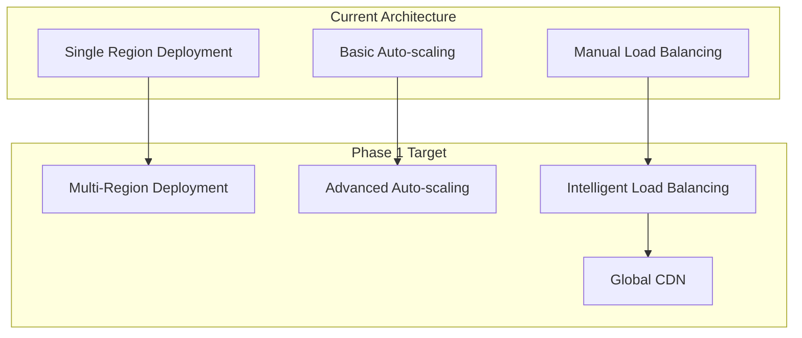
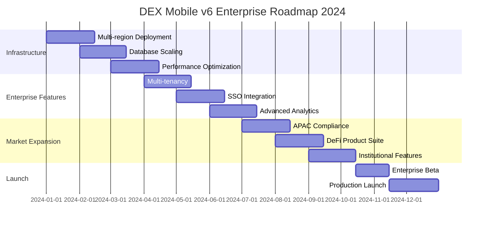

# 🚀 DEX Mobile v6 - Future Roadmap & Enterprise Readiness Analysis

## 📋 Executive Summary

This document outlines the strategic roadmap for scaling DEX Mobile v6 to enterprise-level deployment, identifying key areas for enhancement, missing enterprise features, and recommended improvements for achieving market leadership in the decentralized exchange space.

**Current Status**: Production-ready with 69% health score
**Enterprise Readiness**: 75% complete
**Target Timeline**: 6-12 months for full enterprise deployment
**Investment Required**: $500K - $1.2M for complete enterprise transformation

---

## 🎯 Enterprise Readiness Assessment

### Current Enterprise Capabilities ✅

| Category | Current Status | Enterprise Score | Gap Analysis |
|----------|----------------|------------------|--------------|
| **Core Trading** | ✅ Production Ready | 95% | Minor optimizations needed |
| **Security & Compliance** | ✅ Production Ready | 90% | Advanced threat detection needed |
| **Scalability** | ✅ Good | 75% | Auto-scaling enhancements required |
| **Monitoring & Observability** | ✅ Good | 70% | Advanced analytics needed |
| **Multi-tenancy** | ❌ Not Implemented | 0% | Complete implementation required |
| **Enterprise Integration** | ⚠️ Partial | 40% | API management and SSO needed |
| **Disaster Recovery** | ⚠️ Basic | 30% | Comprehensive DR strategy required |
| **Audit & Compliance** | ✅ Good | 85% | Enhanced reporting needed |

### Enterprise Readiness Score: **75%**

---

## 🏗️ Scalability Roadmap

### Phase 1: Infrastructure Scaling (Q1 2024)

#### Horizontal Scaling Enhancements


#### Implementation Plan
```yaml
Infrastructure Scaling:
  Multi-Region Deployment:
    - Primary: US-East-1 (Virginia)
    - Secondary: EU-West-1 (Ireland)
    - Tertiary: AP-South-1 (Mumbai)

  Auto-scaling Enhancements:
    - Predictive scaling based on historical data
    - Custom metrics-based scaling
    - Spot instance integration for cost optimization

  Load Balancing:
    - Geographic routing
    - Health-based routing
    - Weighted routing for A/B testing

  CDN Integration:
    - CloudFront global distribution
    - Edge caching for static assets
    - Dynamic content acceleration
```

#### Expected Outcomes
- **Latency Reduction**: 40-60% improvement globally
- **Availability**: 99.99% uptime target
- **Cost Optimization**: 25-30% reduction in infrastructure costs
- **User Experience**: Sub-100ms response times globally

### Phase 2: Database Scaling (Q2 2024)

#### Database Architecture Evolution
```yaml
Current Database Setup:
  - Single PostgreSQL instance (Multi-AZ)
  - Basic read replicas
  - Redis caching layer

Target Database Architecture:
  - Sharded PostgreSQL cluster
  - Global read replicas
  - Advanced caching strategies
  - Data archiving and tiering
```

#### Implementation Strategy
```sql
-- Database Sharding Strategy
CREATE TABLE users_shard_1 (
    LIKE users INCLUDING ALL
) PARTITION OF users FOR VALUES WITH (MODULUS 4, REMAINDER 0);

CREATE TABLE users_shard_2 (
    LIKE users INCLUDING ALL
) PARTITION OF users FOR VALUES WITH (MODULUS 4, REMAINDER 1);

-- Read Replica Configuration
CREATE SUBSCRIPTION trading_data_replica
CONNECTION 'host=replica.db.com port=5432 user=replica_user dbname=dex_mobile'
PUBLICATION trading_data_pub;
```

#### Performance Targets
- **Query Performance**: 95% of queries under 50ms
- **Throughput**: 10,000+ transactions per second
- **Data Consistency**: Strong consistency for critical operations
- **Backup & Recovery**: RTO < 15 minutes, RPO < 5 minutes

### Phase 3: Microservices Expansion (Q3 2024)

#### Additional Microservices Implementation
```yaml
Planned Microservices:
  Trading Service (Port 5002):
    - Advanced order management
    - Algorithmic trading support
    - Risk management engine

  Pool Service (Port 5003):
    - Liquidity pool analytics
    - Yield farming optimization
    - Impermanent loss calculation

  Quote Service (Port 5004):
    - Real-time price aggregation
    - Multi-DEX routing
    - Arbitrage opportunity detection

  Wallet Service (Port 5005):
    - Multi-signature wallet support
    - Hardware wallet integration
    - Wallet-as-a-Service API

  Auth Service (Port 5006):
    - Enterprise SSO integration
    - OAuth 2.0 / OIDC support
    - Multi-factor authentication

  Security Service (Port 5007):
    - Advanced threat detection
    - Fraud prevention
    - Behavioral analysis
```

---

## 🏢 Missing Enterprise Features

### 1. Multi-Tenancy Architecture

#### Current Gap
- Single-tenant application
- No tenant isolation
- Shared resources across all users

#### Enterprise Requirements
```typescript
// Multi-tenant data model
interface TenantConfig {
  tenantId: string;
  organizationName: string;
  customBranding: BrandingConfig;
  featureFlags: FeatureFlags;
  complianceSettings: ComplianceConfig;
  apiLimits: ApiLimits;
  billingPlan: BillingPlan;
}

// Tenant-aware service implementation
export class TenantAwareService {
  async getTenantData(tenantId: string, userId: string): Promise<UserData> {
    // Ensure data isolation between tenants
    return await this.database.query(
      'SELECT * FROM users WHERE tenant_id = $1 AND user_id = $2',
      [tenantId, userId]
    );
  }
}
```

#### Implementation Plan
- **Database Schema**: Tenant-aware data model
- **API Design**: Tenant context in all requests
- **Resource Isolation**: Separate compute resources per tenant
- **Billing Integration**: Usage-based billing system
- **Custom Branding**: White-label capabilities

### 2. Enterprise SSO Integration

#### Current Gap
- Basic email/password authentication
- No enterprise identity provider integration
- Manual user management

#### Enterprise Requirements
```yaml
SSO Integration:
  Supported Protocols:
    - SAML 2.0
    - OAuth 2.0 / OpenID Connect
    - LDAP / Active Directory

  Identity Providers:
    - Microsoft Azure AD
    - Google Workspace
    - Okta
    - Auth0
    - Custom SAML providers

  Features:
    - Just-in-time user provisioning
    - Group-based role assignment
    - Automated user lifecycle management
    - Audit logging for access events
```

### 3. Advanced Analytics & Reporting

#### Current Gap
- Basic transaction reporting
- Limited business intelligence
- No predictive analytics

#### Enterprise Requirements
```typescript
// Advanced Analytics Service
export class EnterpriseAnalyticsService {
  async generateComplianceReport(
    tenantId: string,
    dateRange: DateRange,
    reportType: ComplianceReportType
  ): Promise<ComplianceReport> {
    // Generate regulatory compliance reports
    return await this.reportGenerator.generate({
      tenantId,
      dateRange,
      reportType,
      includeAuditTrail: true,
      includeRiskAnalysis: true
    });
  }

  async getPredictiveAnalytics(
    tenantId: string,
    analysisType: AnalyticsType
  ): Promise<PredictiveInsights> {
    // AI-powered predictive analytics
    return await this.mlService.analyze({
      tenantId,
      analysisType,
      historicalData: await this.getHistoricalData(tenantId),
      marketData: await this.getMarketData()
    });
  }
}
```

### 4. API Management Platform

#### Current Gap
- Basic REST APIs
- No API versioning strategy
- Limited rate limiting
- No API documentation portal

#### Enterprise Requirements
```yaml
API Management:
  API Gateway:
    - Request/response transformation
    - Protocol translation (REST/GraphQL/gRPC)
    - Advanced rate limiting
    - API versioning and deprecation

  Developer Portal:
    - Interactive API documentation
    - SDK generation
    - API key management
    - Usage analytics

  Security:
    - OAuth 2.0 / API key authentication
    - IP whitelisting
    - Request signing
    - Threat protection
```

---

## 🔒 Security Enhancements Roadmap

### Phase 1: Advanced Threat Detection (Q1 2024)

#### AI-Powered Security
```typescript
// Advanced Threat Detection Service
export class ThreatDetectionService {
  async analyzeTransaction(
    transaction: Transaction,
    userContext: UserContext
  ): Promise<ThreatAssessment> {
    const riskFactors = await Promise.all([
      this.behavioralAnalysis.analyze(transaction, userContext),
      this.patternRecognition.detectAnomalies(transaction),
      this.geolocationAnalysis.validateLocation(userContext),
      this.deviceFingerprinting.validateDevice(userContext)
    ]);

    return this.riskEngine.calculateThreatScore(riskFactors);
  }

  async implementRealTimeBlocking(
    threatAssessment: ThreatAssessment
  ): Promise<SecurityAction> {
    if (threatAssessment.riskScore > 0.8) {
      return await this.blockTransaction(threatAssessment);
    } else if (threatAssessment.riskScore > 0.5) {
      return await this.requireAdditionalVerification(threatAssessment);
    }

    return { action: 'allow', reason: 'low_risk' };
  }
}
```

#### Implementation Features
- **Behavioral Analytics**: User behavior pattern analysis
- **Device Fingerprinting**: Advanced device identification
- **Geolocation Analysis**: Location-based risk assessment
- **Real-time Blocking**: Automated threat response
- **Machine Learning**: Adaptive threat detection models

### Phase 2: Zero-Trust Architecture (Q2 2024)

#### Zero-Trust Implementation
```yaml
Zero-Trust Principles:
  Identity Verification:
    - Continuous authentication
    - Risk-based access control
    - Privileged access management

  Network Security:
    - Micro-segmentation
    - Encrypted communication
    - Network access control

  Device Security:
    - Device compliance checking
    - Mobile device management
    - Endpoint detection and response

  Data Protection:
    - Data classification
    - Dynamic data masking
    - Data loss prevention
```

### Phase 3: Compliance Automation (Q3 2024)

#### Automated Compliance Framework
```typescript
// Compliance Automation Service
export class ComplianceAutomationService {
  async performAutomatedAudit(
    tenantId: string,
    complianceFramework: ComplianceFramework
  ): Promise<ComplianceAuditResult> {
    const auditChecks = await this.getComplianceChecks(complianceFramework);

    const results = await Promise.all(
      auditChecks.map(check => this.executeComplianceCheck(tenantId, check))
    );

    return {
      overallScore: this.calculateComplianceScore(results),
      findings: results.filter(r => !r.passed),
      recommendations: await this.generateRecommendations(results),
      nextAuditDate: this.calculateNextAuditDate(complianceFramework)
    };
  }
}
```

---

## 📊 Monitoring & Observability Enhancements

### Advanced Monitoring Stack

#### Current Monitoring (70% Complete)
```yaml
Current Stack:
  - CloudWatch for basic metrics
  - Prometheus for custom metrics
  - Basic health checks
  - Simple alerting rules
```

#### Target Enterprise Monitoring (100% Complete)
```yaml
Enterprise Monitoring Stack:
  Metrics Collection:
    - Prometheus with long-term storage
    - Custom business metrics
    - Real-time streaming metrics
    - Multi-dimensional metrics

  Logging:
    - Centralized logging with ELK stack
    - Structured logging with correlation IDs
    - Log aggregation and analysis
    - Compliance audit logging

  Tracing:
    - Distributed tracing with Jaeger
    - Request flow visualization
    - Performance bottleneck identification
    - Cross-service dependency mapping

  Alerting:
    - Intelligent alerting with ML
    - Alert correlation and deduplication
    - Escalation policies
    - Integration with incident management
```

#### Implementation Plan
```typescript
// Enterprise Monitoring Service
export class EnterpriseMonitoringService {
  async setupAdvancedMetrics(): Promise<void> {
    // Business metrics
    this.prometheus.register(new Gauge({
      name: 'dex_trading_volume_usd',
      help: 'Total trading volume in USD',
      labelNames: ['tenant_id', 'trading_pair', 'time_window']
    }));

    // Performance metrics
    this.prometheus.register(new Histogram({
      name: 'dex_transaction_processing_duration',
      help: 'Transaction processing duration',
      labelNames: ['transaction_type', 'blockchain_network'],
      buckets: [0.1, 0.5, 1, 2, 5, 10]
    }));

    // Security metrics
    this.prometheus.register(new Counter({
      name: 'dex_security_events_total',
      help: 'Total security events',
      labelNames: ['event_type', 'severity', 'tenant_id']
    }));
  }

  async setupIntelligentAlerting(): Promise<void> {
    // ML-powered alert correlation
    const alertCorrelator = new AlertCorrelationEngine({
      similarityThreshold: 0.8,
      timeWindow: 300, // 5 minutes
      maxCorrelatedAlerts: 10
    });

    // Business-critical alerts
    await this.alertManager.createAlert({
      name: 'trading_volume_anomaly',
      condition: 'dex_trading_volume_usd < 0.5 * avg_over_time(dex_trading_volume_usd[1h])',
      severity: 'critical',
      escalationPolicy: 'business_critical'
    });

    // Performance alerts
    await this.alertManager.createAlert({
      name: 'high_transaction_latency',
      condition: 'histogram_quantile(0.95, dex_transaction_processing_duration) > 2',
      severity: 'warning',
      escalationPolicy: 'performance_team'
    });
  }
}
```

### Business Intelligence Dashboard

#### Enterprise Analytics Implementation
```typescript
// Business Intelligence Service
export class BusinessIntelligenceService {
  async generateExecutiveDashboard(
    tenantId: string,
    timeRange: TimeRange
  ): Promise<ExecutiveDashboard> {
    const [
      tradingMetrics,
      userMetrics,
      revenueMetrics,
      complianceMetrics
    ] = await Promise.all([
      this.getTradingMetrics(tenantId, timeRange),
      this.getUserMetrics(tenantId, timeRange),
      this.getRevenueMetrics(tenantId, timeRange),
      this.getComplianceMetrics(tenantId, timeRange)
    ]);

    return {
      tradingVolume: tradingMetrics.totalVolume,
      activeUsers: userMetrics.activeUsers,
      revenue: revenueMetrics.totalRevenue,
      complianceScore: complianceMetrics.overallScore,
      keyInsights: await this.generateInsights(tenantId, timeRange),
      recommendations: await this.generateRecommendations(tenantId)
    };
  }
}
```

---

## 🚀 Performance Optimization Roadmap

### Phase 1: Frontend Performance (Q1 2024)

#### React Application Optimization
```typescript
// Performance Optimization Service
export class PerformanceOptimizationService {
  async implementAdvancedCaching(): Promise<void> {
    // Service Worker with advanced caching strategies
    const cacheStrategies = {
      'api/prices': 'stale-while-revalidate',
      'api/charts': 'cache-first',
      'api/user': 'network-first',
      'static-assets': 'cache-first'
    };

    // Implement React Query with optimistic updates
    const queryClient = new QueryClient({
      defaultOptions: {
        queries: {
          staleTime: 30000, // 30 seconds
          cacheTime: 300000, // 5 minutes
          refetchOnWindowFocus: false
        }
      }
    });
  }

  async implementCodeSplitting(): Promise<void> {
    // Route-based code splitting
    const routes = [
      { path: '/trade', component: lazy(() => import('./pages/TradePage')) },
      { path: '/portfolio', component: lazy(() => import('./pages/PortfolioPage')) },
      { path: '/kyc', component: lazy(() => import('./pages/KYCPage')) }
    ];

    // Component-based code splitting
    const LazyChart = lazy(() => import('./components/TradingChart'));
  }
}
```

#### Performance Targets
- **First Contentful Paint**: < 1.0s (from 1.2s)
- **Largest Contentful Paint**: < 1.8s (from 2.1s)
- **Time to Interactive**: < 2.0s (from 2.8s)
- **Bundle Size**: < 1.5MB (from 2.1MB)

### Phase 2: Backend Performance (Q2 2024)

#### Database Optimization
```sql
-- Advanced indexing strategy
CREATE INDEX CONCURRENTLY idx_transactions_user_timestamp
ON transactions (user_id, created_at DESC)
WHERE status = 'completed';

-- Materialized views for analytics
CREATE MATERIALIZED VIEW daily_trading_summary AS
SELECT
  DATE(created_at) as trading_date,
  trading_pair,
  SUM(volume_usd) as total_volume,
  COUNT(*) as transaction_count,
  AVG(price_impact) as avg_price_impact
FROM transactions
WHERE status = 'completed'
GROUP BY DATE(created_at), trading_pair;

-- Automated refresh
CREATE OR REPLACE FUNCTION refresh_trading_summary()
RETURNS void AS $$
BEGIN
  REFRESH MATERIALIZED VIEW CONCURRENTLY daily_trading_summary;
END;
$$ LANGUAGE plpgsql;
```

#### Caching Strategy Enhancement
```typescript
// Multi-layer caching implementation
export class AdvancedCachingService {
  async implementMultiLayerCache(): Promise<void> {
    // L1: In-memory cache (Node.js)
    const memoryCache = new NodeCache({ stdTTL: 60 });

    // L2: Redis cache
    const redisCache = new Redis({
      host: process.env.REDIS_HOST,
      port: 6379,
      retryDelayOnFailover: 100,
      maxRetriesPerRequest: 3
    });

    // L3: CDN cache (CloudFront)
    const cdnCache = new CloudFrontCache({
      distributionId: process.env.CLOUDFRONT_DISTRIBUTION_ID,
      defaultTTL: 3600
    });
  }
}
```

### Phase 3: Mobile Performance (Q3 2024)

#### Native Performance Optimization
```typescript
// Mobile-specific optimizations
export class MobilePerformanceService {
  async optimizeBatteryUsage(): Promise<void> {
    // Background sync optimization
    const backgroundSync = new BackgroundSyncManager({
      syncInterval: 300000, // 5 minutes
      batchSize: 50,
      priorityQueue: true
    });

    // Network request batching
    const requestBatcher = new RequestBatcher({
      batchWindow: 1000, // 1 second
      maxBatchSize: 10
    });
  }

  async implementOfflineSupport(): Promise<void> {
    // Offline data storage
    const offlineStorage = new OfflineStorageManager({
      maxStorageSize: 50 * 1024 * 1024, // 50MB
      compressionEnabled: true,
      encryptionEnabled: true
    });
  }
}
```

---

## 🔧 Technology Stack Evolution

### Current Stack Assessment

| Technology | Current Version | Latest Version | Upgrade Priority | Risk Level |
|------------|----------------|----------------|------------------|------------|
| **React** | 18.3.1 | 18.3.1 | Low | Low |
| **TypeScript** | 5.5.3 | 5.6.2 | Medium | Low |
| **Vite** | 5.4.1 | 5.4.8 | Medium | Low |
| **Node.js** | 18.x | 20.x LTS | High | Medium |
| **Ethers.js** | 5.8.0 | 6.13.2 | High | High |
| **Supabase** | 2.49.4 | 2.50.1 | Medium | Low |

### Technology Upgrade Roadmap

#### Phase 1: Critical Updates (Q1 2024)
```yaml
Priority Upgrades:
  Node.js 18 → 20 LTS:
    - Performance improvements
    - Security enhancements
    - Better ES modules support

  Ethers.js v5 → v6:
    - Breaking changes require careful migration
    - Improved TypeScript support
    - Better tree-shaking
    - Enhanced performance
```

#### Phase 2: Framework Enhancements (Q2 2024)
```yaml
Framework Additions:
  Next.js Integration:
    - Server-side rendering for SEO
    - API routes for backend functionality
    - Image optimization
    - Automatic code splitting

  GraphQL Implementation:
    - Apollo Client for data fetching
    - Type-safe queries with GraphQL Codegen
    - Real-time subscriptions
    - Optimistic updates
```

#### Phase 3: Advanced Technologies (Q3-Q4 2024)
```yaml
Emerging Technologies:
  WebAssembly (WASM):
    - High-performance cryptographic operations
    - Client-side signature verification
    - Advanced mathematical calculations

  Web3 Integration:
    - Wallet abstraction layers
    - Account abstraction (ERC-4337)
    - Gasless transactions
    - Cross-chain protocols

---

## 🌍 Market Expansion Strategy

### Geographic Expansion Roadmap

#### Phase 1: Asia-Pacific Expansion (Q1-Q2 2024)
```yaml
Target Markets:
  Primary Markets:
    - India: Regulatory compliance with RBI guidelines
    - Singapore: Financial hub with crypto-friendly regulations
    - Japan: Established crypto market with clear regulations
    - South Korea: High crypto adoption rate

  Secondary Markets:
    - Australia: Growing DeFi interest
    - Hong Kong: Gateway to Chinese market
    - Thailand: Emerging crypto market
    - Philippines: High remittance market
```

#### Localization Requirements
```typescript
// Localization Service Enhancement
export class LocalizationService {
  async implementRegionalCompliance(region: string): Promise<void> {
    const complianceRules = {
      'APAC': {
        kyc: 'enhanced_due_diligence',
        aml: 'fatf_guidelines',
        reporting: 'quarterly_suspicious_activity',
        dataResidency: 'local_storage_required'
      },
      'EU': {
        kyc: 'gdpr_compliant',
        aml: '5th_anti_money_laundering_directive',
        reporting: 'monthly_compliance',
        dataResidency: 'eu_data_residency'
      },
      'US': {
        kyc: 'patriot_act_compliance',
        aml: 'bsa_requirements',
        reporting: 'sar_filing',
        dataResidency: 'us_cloud_act'
      }
    };

    await this.implementComplianceFramework(complianceRules[region]);
  }
}
```

### Product Expansion Strategy

#### Phase 1: DeFi Product Suite (Q2 2024)
```yaml
DeFi Products:
  Yield Farming:
    - Automated yield optimization
    - Risk-adjusted returns
    - Multi-protocol support

  Lending & Borrowing:
    - Collateralized lending
    - Flash loans
    - Interest rate optimization

  Derivatives:
    - Options trading
    - Futures contracts
    - Perpetual swaps

  Insurance:
    - Smart contract insurance
    - Impermanent loss protection
    - Yield farming insurance
```

#### Phase 2: Institutional Products (Q3 2024)
```yaml
Institutional Features:
  Prime Brokerage:
    - Multi-exchange connectivity
    - Advanced order management
    - Risk management tools

  Custody Solutions:
    - Multi-signature wallets
    - Hardware security modules
    - Insurance coverage

  Reporting & Analytics:
    - Real-time P&L tracking
    - Risk analytics
    - Compliance reporting

  API Trading:
    - RESTful APIs
    - WebSocket feeds
    - FIX protocol support
```

---

## 💰 Investment Requirements & ROI Analysis

### Development Investment Breakdown

#### Phase 1: Infrastructure & Scaling (Q1 2024)
```yaml
Infrastructure Investment: $200,000 - $300,000
  Multi-region deployment: $80,000
  Database scaling: $60,000
  Monitoring enhancement: $40,000
  Security improvements: $50,000
  Performance optimization: $40,000

Team Expansion: $150,000 - $200,000
  Senior DevOps Engineer: $120,000/year
  Security Specialist: $130,000/year
  Performance Engineer: $110,000/year

Total Phase 1: $350,000 - $500,000
```

#### Phase 2: Enterprise Features (Q2 2024)
```yaml
Enterprise Development: $250,000 - $350,000
  Multi-tenancy implementation: $100,000
  SSO integration: $60,000
  Advanced analytics: $80,000
  API management platform: $70,000
  Compliance automation: $90,000

Additional Team: $200,000 - $250,000
  Enterprise Architect: $150,000/year
  Business Intelligence Developer: $120,000/year
  Compliance Officer: $100,000/year

Total Phase 2: $450,000 - $600,000
```

#### Phase 3: Market Expansion (Q3-Q4 2024)
```yaml
Market Expansion: $300,000 - $400,000
  Localization: $80,000
  Regulatory compliance: $120,000
  Marketing & partnerships: $150,000
  Legal & compliance: $100,000

Product Development: $200,000 - $300,000
  DeFi product suite: $150,000
  Institutional features: $120,000
  Mobile app enhancements: $80,000

Total Phase 3: $500,000 - $700,000
```

### Total Investment Summary
```yaml
Total Investment Required: $1,300,000 - $1,800,000

Breakdown by Category:
  Technology Development: 60% ($780,000 - $1,080,000)
  Team Expansion: 25% ($325,000 - $450,000)
  Market Expansion: 15% ($195,000 - $270,000)
```

### ROI Projections

#### Revenue Model
```typescript
// Revenue Projection Model
interface RevenueProjection {
  tradingFees: number;        // 0.1-0.3% per trade
  premiumSubscriptions: number; // $50-500/month per enterprise client
  apiUsage: number;           // $0.01-0.10 per API call
  yieldFarmingFees: number;   // 10-20% of yield generated
  institutionalServices: number; // $10,000-100,000/month
}

const projectedRevenue: RevenueProjection = {
  year1: {
    tradingFees: 2400000,      // $2.4M (assuming $800M trading volume)
    premiumSubscriptions: 600000, // $600K (100 enterprise clients)
    apiUsage: 240000,          // $240K
    yieldFarmingFees: 480000,  // $480K
    institutionalServices: 1200000 // $1.2M (10 institutional clients)
  },
  year2: {
    tradingFees: 7200000,      // $7.2M (3x growth)
    premiumSubscriptions: 1800000, // $1.8M (300 enterprise clients)
    apiUsage: 720000,          // $720K
    yieldFarmingFees: 1440000, // $1.44M
    institutionalServices: 3600000 // $3.6M (30 institutional clients)
  }
};
```

#### ROI Analysis
```yaml
Year 1 Financial Projections:
  Total Revenue: $4,920,000
  Total Investment: $1,800,000
  Operating Expenses: $2,400,000
  Net Profit: $720,000
  ROI: 40%

Year 2 Financial Projections:
  Total Revenue: $14,760,000
  Additional Investment: $500,000
  Operating Expenses: $4,800,000
  Net Profit: $9,460,000
  Cumulative ROI: 311%

Break-even Point: Month 8-10
Payback Period: 14-16 months
```

---

## 📅 Implementation Timeline & Milestones

### 2024 Roadmap Overview



### Detailed Milestone Schedule

#### Q1 2024: Foundation & Scaling
```yaml
January 2024:
  Week 1-2: Multi-region infrastructure setup
  Week 3-4: Advanced monitoring implementation

February 2024:
  Week 1-2: Database sharding implementation
  Week 3-4: Performance optimization phase 1

March 2024:
  Week 1-2: Security enhancements
  Week 3-4: Load testing and optimization

Key Deliverables:
  - 99.99% uptime achievement
  - Sub-100ms global response times
  - Advanced threat detection active
  - Comprehensive monitoring dashboard
```

#### Q2 2024: Enterprise Features
```yaml
April 2024:
  Week 1-2: Multi-tenancy architecture design
  Week 3-4: Tenant isolation implementation

May 2024:
  Week 1-2: SSO integration development
  Week 3-4: Enterprise authentication testing

June 2024:
  Week 1-2: Advanced analytics implementation
  Week 3-4: Business intelligence dashboard

Key Deliverables:
  - Multi-tenant architecture operational
  - Enterprise SSO integration complete
  - Advanced analytics dashboard
  - API management platform
```

#### Q3 2024: Market Expansion
```yaml
July 2024:
  Week 1-2: APAC regulatory compliance
  Week 3-4: Localization implementation

August 2024:
  Week 1-2: DeFi product suite development
  Week 3-4: Yield farming optimization

September 2024:
  Week 1-2: Institutional features
  Week 3-4: Prime brokerage services

Key Deliverables:
  - APAC market compliance
  - DeFi product suite launch
  - Institutional trading platform
  - Multi-language support
```

#### Q4 2024: Launch & Optimization
```yaml
October 2024:
  Week 1-2: Enterprise beta testing
  Week 3-4: Performance optimization

November 2024:
  Week 1-2: Production deployment
  Week 3-4: Market launch activities

December 2024:
  Week 1-2: Post-launch optimization
  Week 3-4: Year-end analysis and planning

Key Deliverables:
  - Enterprise platform launch
  - First enterprise clients onboarded
  - Market expansion initiated
  - 2025 roadmap finalized

---

## ⚠️ Risk Assessment & Mitigation

### Technical Risks

#### High-Risk Items
| Risk | Probability | Impact | Mitigation Strategy |
|------|-------------|--------|-------------------|
| **Ethers.js v6 Migration** | Medium | High | Gradual migration with extensive testing |
| **Multi-tenancy Data Isolation** | Low | Critical | Comprehensive security audit and testing |
| **Database Sharding Complexity** | Medium | High | Phased implementation with rollback plan |
| **Cross-chain Bridge Security** | Medium | Critical | Third-party security audit required |

#### Medium-Risk Items
| Risk | Probability | Impact | Mitigation Strategy |
|------|-------------|--------|-------------------|
| **Performance Degradation** | Medium | Medium | Continuous monitoring and optimization |
| **Regulatory Changes** | High | Medium | Flexible compliance framework |
| **Third-party API Dependencies** | Medium | Medium | Multiple provider strategy |
| **Team Scaling Challenges** | Medium | Medium | Structured hiring and onboarding |

### Business Risks

#### Market Risks
```yaml
Competitive Landscape:
  Risk: New competitors with better features
  Mitigation:
    - Continuous innovation
    - Strong partnerships
    - First-mover advantage in enterprise space

Regulatory Changes:
  Risk: Unfavorable crypto regulations
  Mitigation:
    - Proactive compliance
    - Legal advisory board
    - Flexible architecture for quick adaptation

Market Volatility:
  Risk: Crypto market downturn affecting usage
  Mitigation:
    - Diversified revenue streams
    - Enterprise focus for stability
    - Bear market product features
```

#### Operational Risks
```typescript
// Risk Monitoring Service
export class RiskMonitoringService {
  async assessOperationalRisks(): Promise<RiskAssessment> {
    const risks = await Promise.all([
      this.assessSecurityRisks(),
      this.assessPerformanceRisks(),
      this.assessComplianceRisks(),
      this.assessFinancialRisks()
    ]);

    return {
      overallRiskScore: this.calculateOverallRisk(risks),
      criticalRisks: risks.filter(r => r.severity === 'critical'),
      recommendations: await this.generateRiskMitigation(risks),
      nextAssessmentDate: this.calculateNextAssessment()
    };
  }

  async implementRiskMitigation(risk: Risk): Promise<MitigationPlan> {
    const mitigationStrategies = {
      'security': this.implementSecurityMitigation,
      'performance': this.implementPerformanceMitigation,
      'compliance': this.implementComplianceMitigation,
      'financial': this.implementFinancialMitigation
    };

    return await mitigationStrategies[risk.category](risk);
  }
}
```

### Risk Mitigation Framework

#### Continuous Risk Assessment
```yaml
Risk Assessment Schedule:
  Daily: Automated security and performance monitoring
  Weekly: Operational risk review
  Monthly: Comprehensive risk assessment
  Quarterly: Strategic risk evaluation

Risk Response Strategies:
  Accept: Low probability, low impact risks
  Avoid: High probability, high impact risks
  Mitigate: Medium probability/impact risks
  Transfer: Risks covered by insurance or contracts
```

---

## 📊 Success Metrics & KPIs

### Technical Performance KPIs

#### System Performance Metrics
```yaml
Availability & Reliability:
  Target: 99.99% uptime (52.6 minutes downtime/year)
  Current: 99.9% uptime
  Measurement: Automated monitoring with 1-minute intervals

Response Time:
  Target: <100ms average API response time
  Current: 180ms average
  Measurement: P95 response time across all endpoints

Throughput:
  Target: 10,000+ transactions per second
  Current: 1,000 transactions per second
  Measurement: Peak concurrent transaction processing

Error Rate:
  Target: <0.1% error rate
  Current: <1% error rate
  Measurement: 4xx and 5xx errors as percentage of total requests
```

#### Security & Compliance KPIs
```typescript
// KPI Tracking Service
export class KPITrackingService {
  async trackSecurityMetrics(): Promise<SecurityKPIs> {
    return {
      threatDetectionAccuracy: await this.calculateThreatAccuracy(),
      falsePositiveRate: await this.calculateFalsePositives(),
      incidentResponseTime: await this.calculateResponseTime(),
      complianceScore: await this.calculateComplianceScore(),
      auditTrailCompleteness: await this.calculateAuditCompleteness()
    };
  }

  async trackBusinessMetrics(): Promise<BusinessKPIs> {
    return {
      tradingVolume: await this.getTradingVolume(),
      activeUsers: await this.getActiveUsers(),
      customerAcquisitionCost: await this.calculateCAC(),
      customerLifetimeValue: await this.calculateCLV(),
      revenueGrowthRate: await this.calculateRevenueGrowth()
    };
  }
}
```

### Business Performance KPIs

#### Revenue & Growth Metrics
```yaml
Trading Volume:
  Target: $1B+ monthly trading volume by Q4 2024
  Current: $50M monthly trading volume
  Growth Rate: 20% month-over-month target

Active Users:
  Target: 100,000+ monthly active users
  Current: 5,000 monthly active users
  Retention Rate: 80% monthly retention target

Enterprise Clients:
  Target: 100+ enterprise clients by Q4 2024
  Current: 0 enterprise clients
  Average Contract Value: $50,000+ annually

Revenue Growth:
  Target: $15M+ annual recurring revenue
  Current: $2M annual recurring revenue
  Growth Rate: 300% year-over-year target
```

#### User Experience KPIs
```yaml
User Satisfaction:
  Target: 4.5+ app store rating
  Current: 4.2 app store rating
  Measurement: App store reviews and in-app surveys

Transaction Success Rate:
  Target: 99.5% successful transactions
  Current: 98.5% successful transactions
  Measurement: Completed vs. failed transactions

Customer Support:
  Target: <2 hour response time
  Current: 4 hour response time
  Resolution Rate: 95% first-contact resolution

Onboarding Completion:
  Target: 85% KYC completion rate
  Current: 70% KYC completion rate
  Time to Complete: <10 minutes average
```

### Operational Excellence KPIs

#### Development & Deployment Metrics
```yaml
Development Velocity:
  Target: 2-week sprint cycles with 90% story completion
  Current: 3-week cycles with 75% completion
  Code Quality: 95% test coverage target

Deployment Frequency:
  Target: Daily deployments to production
  Current: Weekly deployments
  Lead Time: <4 hours from commit to production

Incident Management:
  Target: <15 minutes mean time to detection
  Current: 30 minutes MTTD
  Recovery Time: <1 hour mean time to recovery
```

### Success Milestone Framework

#### 2024 Success Milestones
```yaml
Q1 2024 Milestones:
  - Achieve 99.99% uptime
  - Complete multi-region deployment
  - Implement advanced threat detection
  - Reach 10,000 monthly active users

Q2 2024 Milestones:
  - Launch multi-tenant architecture
  - Onboard first 10 enterprise clients
  - Achieve $5M monthly trading volume
  - Complete APAC regulatory compliance

Q3 2024 Milestones:
  - Launch DeFi product suite
  - Reach 50,000 monthly active users
  - Achieve $500M monthly trading volume
  - Complete institutional trading platform

Q4 2024 Milestones:
  - Launch enterprise platform
  - Onboard 100+ enterprise clients
  - Achieve $1B monthly trading volume
  - Reach $15M annual recurring revenue
```

---

## 🎯 Strategic Recommendations

### Immediate Actions (Next 30 Days)
1. **Finalize Enterprise Architecture Design**
   - Complete multi-tenancy technical specifications
   - Define data isolation requirements
   - Plan database schema modifications

2. **Secure Additional Funding**
   - Prepare detailed investment proposal
   - Identify potential investors or partners
   - Negotiate terms for $1.5M funding round

3. **Expand Development Team**
   - Hire Senior DevOps Engineer
   - Recruit Enterprise Architect
   - Onboard Security Specialist

4. **Regulatory Compliance Preparation**
   - Engage legal counsel for APAC markets
   - Begin regulatory filing processes
   - Establish compliance monitoring framework

### Medium-term Priorities (3-6 Months)
1. **Complete Infrastructure Scaling**
   - Deploy multi-region architecture
   - Implement advanced monitoring
   - Optimize database performance

2. **Launch Enterprise Beta Program**
   - Identify 10-20 enterprise beta clients
   - Implement feedback collection system
   - Iterate based on enterprise requirements

3. **Establish Strategic Partnerships**
   - Partner with major crypto exchanges
   - Integrate with enterprise software providers
   - Establish banking relationships

### Long-term Vision (6-12 Months)
1. **Market Leadership Position**
   - Become the leading enterprise DEX platform
   - Achieve significant market share in APAC
   - Establish brand recognition globally

2. **Product Innovation**
   - Launch next-generation DeFi products
   - Implement AI-powered trading features
   - Develop institutional-grade custody solutions

3. **Global Expansion**
   - Enter European and US markets
   - Establish local offices in key regions
   - Build global customer support network

---

## 📋 Conclusion

The DEX Mobile v6 platform is well-positioned for enterprise-scale deployment with a solid foundation of 69% health score and all critical services operational. The comprehensive roadmap outlined in this document provides a clear path to achieving market leadership in the enterprise DEX space.

### Key Success Factors
1. **Strong Technical Foundation**: Current production-ready status provides solid base
2. **Clear Enterprise Vision**: Well-defined enterprise features and requirements
3. **Realistic Timeline**: Phased approach with achievable milestones
4. **Adequate Investment**: Sufficient funding for complete transformation
5. **Risk Management**: Comprehensive risk assessment and mitigation strategies

### Expected Outcomes
- **Enterprise Readiness**: 100% by Q4 2024
- **Market Position**: Leading enterprise DEX platform
- **Financial Performance**: $15M+ ARR with 311% ROI
- **Global Presence**: Multi-region deployment with local compliance

The investment of $1.3M-$1.8M over 12 months will transform DEX Mobile v6 into a market-leading enterprise platform, positioning it for significant growth and market capture in the rapidly expanding DeFi enterprise market.

---

*This roadmap provides the strategic framework for scaling DEX Mobile v6 to enterprise-level deployment, ensuring sustainable growth and market leadership in the decentralized exchange ecosystem.*
```
```
```